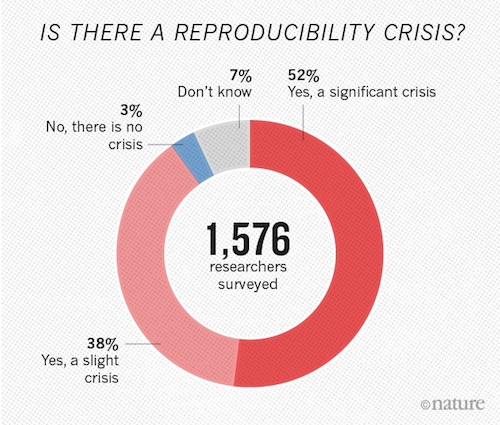
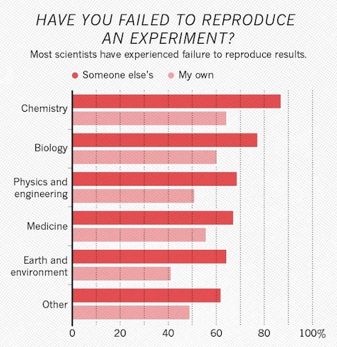
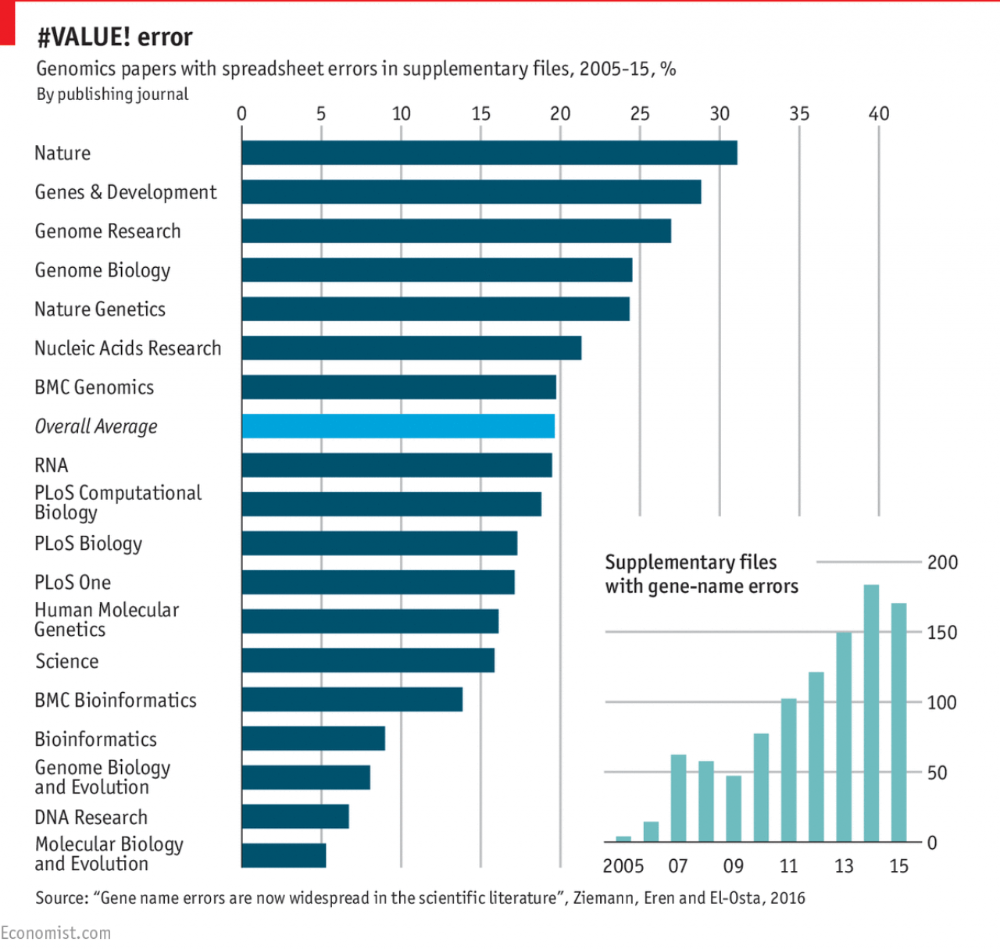
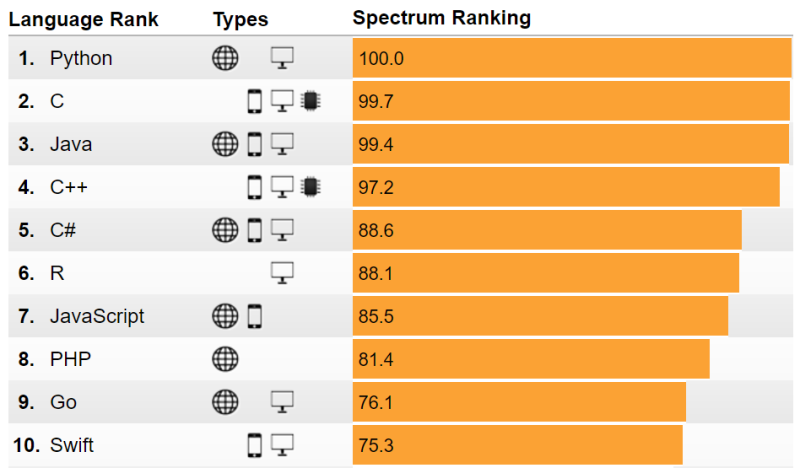
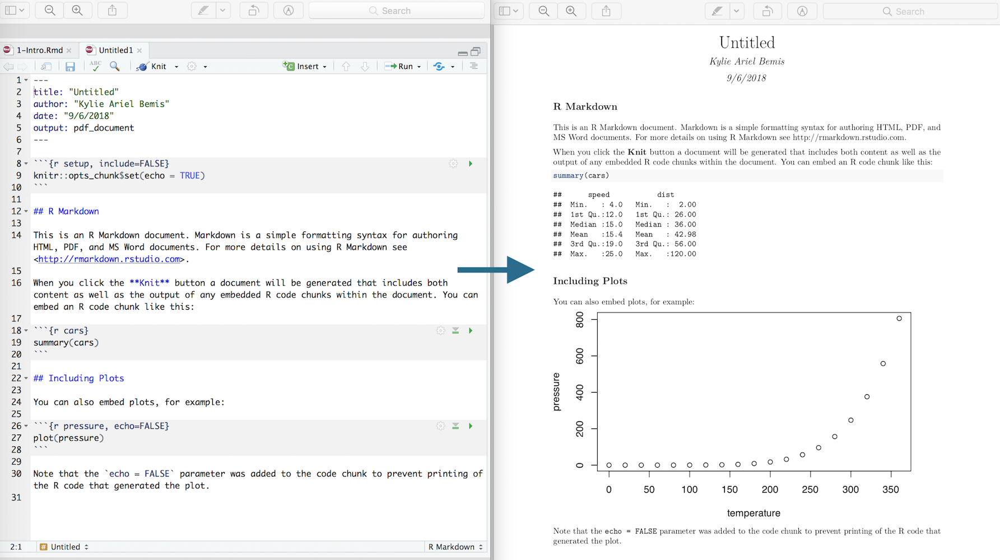

```{r setup, include=FALSE}
knitr::opts_chunk$set(echo = TRUE)
```

## Course information

**Schedule:** Tuesdays/Fridays 3:25 pm - 5:05 pm

**Location:** East Village 024

**Dates:** Jan 07, 2019 - Apr 27, 2019

**Website:** https://kuwisdelu.github.io/ds5110-spring19.html

**Administration:** https://piazza.com/northeastern/spring2019/ds5110

## Textbooks

- [_R for Data Science_](http://r4ds.had.co.nz/)
by Wickham and Grolemund,

- [_Text Mining with R_](https://www.tidytextmining.com/)
by Silge and Robinson

- [_Advanced R_](http://adv-r.had.co.nz/)
by Wickham

- All are available for free online

- Deadtree copies can be obtained via Amazon

- Supplementary (free, online) readings may be posted later in the course

## Preview of course topics

- Data visualization
- Data transformation
- Importing and tidying data
- Relational databases
- Modeling
- Text mining
- Reproducibility
- Big data

## Staff and office hours

**Instructor:** [**Kylie Bemis**](http://www.ccis.northeastern.edu/people/kylie-ariel-bemis/) |
k.bemis@northeastern.edu

- *Office Hours:* Wed 2:00 pm - 3:00 pm @ WVH 310G

**TA:** **Nischal Chand** |
mahaveerchand.n@husky.neu.edu

- *Office Hours:* Fri 1:00 pm - 2:00 pm @ TBA

**TA:** **Amel Docena** |
docena.a@husky.neu.edu

- *Office Hours:* Fri 2:00 pm - 3:00 pm @ WVH 166

**TA:** **Yijia Hao** |
hao.yij@husky.neu.edu

- *Office Hours:* Thu 3:00 pm - 4:00 pm @ Snell Library

**TA:** **Viral Pandey** |
pandey.v@husky.neu.edu

- *Office Hours:* Wed 3:00 pm - 5:00 pm @ WVH 102

**TA:** **Mounica Subramani** |
subramani.m@husky.neu.edu

- *Office Hours:* Mon 3:00pm - 4:00 pm @ WVH 164

\normalsize

## Piazza

- All questions, homework postings, and course announcements are handled via [Piazza](https://piazza.com/northeastern/spring2019/ds5110/home).

- Enroll today at:
    + https://piazza.com/northeastern/spring2019/ds5110

- **Please do not directly email the instructor or TAs with questions -- use Piazza instead**

## Policies

- Please let me know if you use a different name or pronouns from what appears the class roster.
    
    + You may use a preferred name on Piazza and when submitting course work, but please be consistent and inform instructors

- Please reach out to me early if you have difficulty keeping up with class material or completing assignments for personal reasons.

    + The [We Care](https://studentlife.northeastern.edu/we-care/) program at Northeastern University is a resource available to you in times of stress or difficulty.

- All students are expected to abide by the university’s academic integrity policy and respect Northeastern’s commitment to diversity and inclusion.

    + More on this in a moment

- Please be kind and respectful to your fellow students regardless of identity or background.

## Academic integrity

- Be familiar with the university's [academic integrity policy](http://www.northeastern.edu/osccr/academic-integrity-policy/) on cheating and plagiarism.

- All submitted solutions on homeworks and exams must be your own work.

- Discussion of topics presented in class and general strategies for solving homework problems is allowed and encouraged.

- Sharing of fully-worked or near-complete solutions is not tolerated however, and will be considered cheating.

- If your work exhibits a very high degree of similarity to another student's, it is considered plagiarism.

- **Students found to be cheating or plagiarising work will receive an F and be reported to the university.**

    + You are here to learn, not manufacture good grades.

    + If you need help, ask the instructor or a TA.

    + Remember you can ask questions anonymously and privately message instructors on Piazza

## Homework

- There will be 6 homework assignments to be completed individually.

- They are due before class on the date indicated on the class website.

- Homeworks are to be submitted via Piazza (see instructions on each homework for details)

- Each homework must be submitted as an R Markdown source file and PDF output (this will be discussed more soon)

- Homeworks will be posted on Piazza ~1.5 weeks before they are due

- Requests for re-grades must be made in writing no later than 1 week after receiving the grade

    + The new grade may be lower than the original

## Exams

- There will be 2 exams

- 1 midterm and 1 final

- Both will be completed in-class

- Both will be pen(cil)-and-paper

## Final Project

- There will be 1 final project to be completed in groups of 3-5

- Project groups will be due at the midterm

- Groups will submit a proposal outlining their project idea

- Use a dataset of your choice

- Presentations in-class (last 2 weeks) and written report

## Grading

Grades are based out of 1000 points, distributed as follows:

- Homework: 6 x 50 pts
- Midterm Exam: 200 pts
- Final Exam: 200 pts
- Final Project: 300 pts
	  + Project proposal: 50 pts
	  + In-class presentation: 100 pts
	  + Final written report: 150 pts

Final grades will be given on the following scale:

- A : 900 - 1000 pts
- B : 800 - 899 pts
- C : 700 - 799 pts
- F : <= 699 pts

Half-letter-grades ('+' and '-') will be given as well, using cut-offs determined at the end of the semester.

## Notes on Grading

- Homework solutions that appear to be copied from another student's will receive a 0

- Homework solutions should include the problem numbers, clearly labeled, in order

    + Points will be deducted on homework with formatting that makes it very difficult to grade

- Please be sure to answer all parts of the question for full credit

- Please proofread project proposal, slides, and reports before submitting them

    + Points will be deducted on the project for content that has clearly not been proofread

## Tools for this course

- Required:

    + Install R from CRAN

    + https://cloud.r-project.org

- Recommended:

    + Install RStudio
    
    + https://www.rstudio.com/download

    
## Install packages

- Tidyverse

```{r eval=FALSE}
install.packages("tidyverse")
library(tidyverse)
```

- Additional packages

```{r eval=FALSE}
install.packages(c("nycflights13", "gapminder"))
```

- R Markdown (installed automatically with RStudio)

```{r eval=FALSE}
install.packages("rmarkdown")
```

# Introduction to Data Science

## What is Data Science?

A data scientist blends several different areas of expertise to draw insights from data:

- Statistics

- Machine Learning

- Computer science

- Domain knowledge

A data scientist leverages these skills to make inferences that drive decision-making in a particular field of application.

## Data Science process

- Understand the problem

    + What is the purpose of this data analysis?
    
    + May require domain knowledge

- What data is required?

    + May need to pull/scrape data from database/online
    
    + May need to identify appropriate subset of data

    + Most data needs to be cleaned and preprocessed
    
- Perform the analysis

    + What kind of analysis is appropriate? (Regression, clustering, etc.)
    
    + Visualize the cleaned data and the analytic results
    
- Summarize results into meaningful conclusions

    + What insights or decision-making do the results suggest?
    
    + Communicate the results in an easy-to-understand way

## Data Science pipeline


## What does a Data Scientist do?

- visualize data

- pull from a database

- scrape from a website

- clean and wrangle data

- run a regression

- build and train a model

- design an experiment

- split-apply-combine

- write a shell script

- test a hypothesis

- interpret a p-value

- reproduce results

- clearly communicate insights

You should be able to do >= 80% of this by the end of this course.

## Reproducibility

{width=75%}

## Failure to reproduce experiments

{width=75%}

## Gene name errors due to Excel

{width=70%}

## Coding helps reproducibility

- Often asked by experimentalists who wish to analyze data

- Writing code encourages reproducible research

- Code can be documented and analyses re-run

- Open-source encourages others to test and reproduce results

- Interactive analysis can be done in a programmatic environment

- Programming is an integral part of reproducibility

But writing coding alone doesn't guarantee reproducible analyses!

## Why R?

{width=90%}

## Why R for data science?

{width=90%}

## R is a language for data

- Designed specifically for data analysis

- Consistently one of the top languages for data science

- Interactive environment for visualization and statistical analysis

- Rich community of over 12,000 packages on CRAN

- Emphasizes reproducible research

## R Markdown

- Authoring framework for data science

- Code for analysis embedded in report

- Documents are fully reproducible

- You will submit homeworks in R Markdown

## R Markdown workflow



# Introduction to R

## A brief history of R ##

- S created by John Chambers at Bell Laboratories in 1976
- "Turn ideas into software, quickly and faithfully"
- R created in 1993 as a free, open-source implementation of S
- Influenced by S, Scheme, Common Lisp, XLispStat

## Basic data types (atomic) ##

There are six 'atomic' data types:

- **character**
- **double**
- **integer**
- **logical**
- raw
- complex

Most of the time, R will not distinguish between integer and double, as both are considered *numeric* vectors by R.

----

```{r}
"a"
1
1L
TRUE
```

----

- Everything is a vector in R

- "Scalars" are actually length-1 vectors

- Vectors of atomic types are created using __c()__

- Sequences of integers can be shortcut via __start:end__

- Assignment is done via __<-__

----

```{r}
c("a", "b", "c", "d")
c(1, 2.2, 3.33, 4.444)
c(1L, 2L, 3L, 4L)
c(TRUE, FALSE, TRUE, NA)
```

----

```{r}
x <- c(1, 2, 3, 4)
x
y <- 1:4
y
```

## Basic data types (non-atomic)

Atomic vector types are used to build more complex data types:

- matrix
- array
- list
- data.frame

This class will primarily discuss and make use of data.frames, which are the most common way of storing data in R.

For most types of data, systematic and tidy use of data.frames makes data analysis quick and easy.

----

```{r}
matrix(c(1, 2, 3, 4), nrow=2, ncol=2)
```

----

```{r}
array(1:12, dim=c(2,3,2))
```

----

```{r}
list(1L, "a", 3.14)
```

----

```{r}
data.frame(x=c(1, 2, 3), y=c("a", "b", "c"))
```

----

The table below visualizes the relationship between these basic data types:

R data types | Same types | Different types
-------------|------------|----------------
   1d        |  vector    |  list
   2d        |  matrix    |  data.frame
   nd        |  array     |  <NA>

----

Each of these data types can be subsetted in multiple ways:

R subscripts         | Simplifying    | Preserving
---------------------|----------------|-----------
vectors              | x[[1]]         | x[1:6]
matrices/data.frames | x[,1]          | x[,1,drop=FALSE]
lists                | x[[1]], x$name | x[1]

Note that indexing in R begins with 1, _not_ 0.

Also note that data.frames are actually a special type of list, and can also be subset in the same ways that a list can.

----

```{r}
z <- list(1L, "a", 3.14)
z[1:2]
z[1]
z[[1]]
```

----

```{r}
df <- data.frame(x=c(1, 2, 3), y=c("a", "b", "c"))
df$x
df[,"y"]
df[1:2,]
```

## Documentation

- Access help page for any R function using __help(name)__

- Syntactic sugar is available as __?name__

- You may need to quote special names with backticks

## Functions

Functions are created with the `function` keyword, and then assigned to a variable.

```{r}
add <- function(a, b) {
  a + b
}
add(1, 2)
```

## Functions (cont'd)

Functions are first-class, and can be treated as any other variable.

```{r}
add2 <- add
add2(2, 3)
```

## Functions (cont'd)

Functions do not need to be assigned to a variable to be called.

```{r}
(function(a, b) a + b)(1, 2)
```

## Control flow

Control flow in R includes `if`/`else` statements, `while` loops, and `for` loops, and the `switch` function.

```{r}
if (TRUE) {
  print(1)
} else {
  print(2)
}
```

```{r}
i <- 1
while(i < 3) {
  print(i)
  i <- i + 1
}
```

## Control flow

Control flow in R includes `if`/`else` statements, `while` loops, and `for` loops, and the `switch` function.

```{r}
if (TRUE) {
  print(1)
} else {
  print(2)
}
```

## Control flow (cont'd)

```{r}
i <- 1
while(i < 3) {
  print(i)
  i <- i + 1
}
```

## Control flow (cont'd)

```{r}
for ( i in 1:3 ) {
  print(i)
}
```

## Control flow (cont'd)

```{r}
x <- "b"
switch(x, a=1, b=2)
y <- 2
switch(y, "a", "b")
```

## Apply functions

Rather than using `for` loops, it is common to use the `*apply` family of functions. These allow applying a function over each element of a vector.

- `lapply` always returns its results as a list.

- `sapply` is a variant of `lapply` that attempts to simplify its final result

- `vapply` is a variant of `lapply` that simplifies its result according to a template.

## Apply functions (cont'd)

`lapply` always returns its results as a list.

```{r}
x <- list(1:3, 4:6, 7:9)
lapply(x, sum)
```

## Apply functions (cont'd)

`sapply` is a variant of `lapply` that attempts to simplify its final result into a homogenous vector, matrix, or array.

```{r}
x <- list(1:3, 4:6, 7:9)
sapply(x, sum)
```

## Apply functions (cont'd)

`vapply` is a variant of `lapply` that simplifies its result according to a user-supplied template.

```{r}
x <- list(1:3, 4:6, 7:9)
vapply(x, sum, numeric(1))
```

## Plotting

- Base R plotting uses "brush on canvas" philosophy

- Plot elements are plotted individually, one on top of another

- Allows "formula" interface

- Good enough for basic plots

- Simple and flexible

- We will learn a more powerful alternative (ggplot2) next week

----

```{r}
x <- seq(from=0, to=2*pi, length.out=100)
sinx <- sin(x)
plot(x, sinx)
```

----

```{r}
df <- data.frame(x=x, y=sinx)
plot(y ~ x, data=df)
```

---

```{r}
x <- rnorm(100)
hist(x)
```

# Next week we will discuss more advanced and systematic data visualization with a layered "grammar of graphics" using ggplot2

