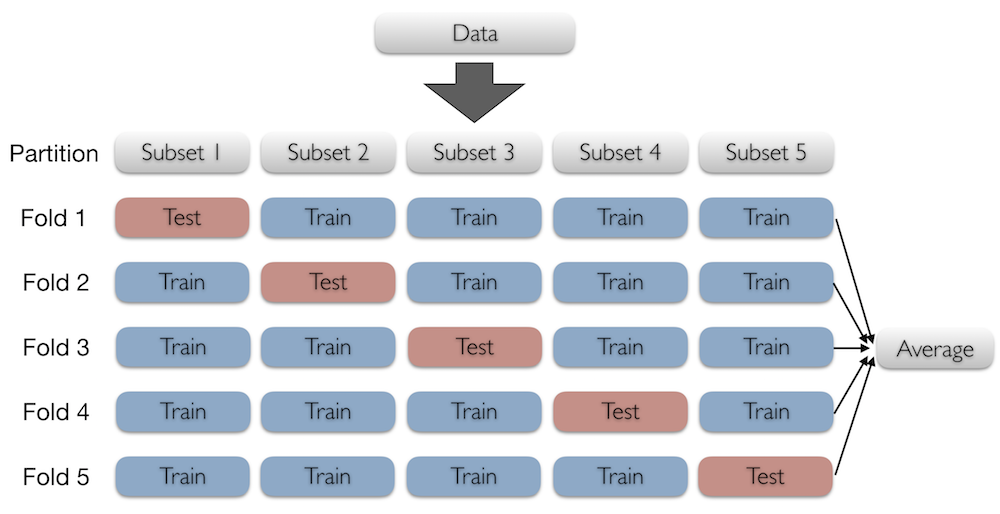

```{r setup, include=FALSE}
knitr::opts_chunk$set(echo = TRUE)
library(tidyverse)
```

## Advanced Modeling

> All models are wrong, but some are useful.

-- George Box


## Suppose we want to predict flight arrival delays

```{r}
library(nycflights13)
flights2 <- transmute(flights,
                      month = factor(month,
                                     levels=1:12),
                      dep_time = factor(dep_time %/% 100,
                                        levels=0:23),
                      arr_delay, dep_delay,
                      origin, dest, distance)
library(modelr)
set.seed(1)  # remember to set seeds for reproducibility!
flights3 <- resample(flights2, sample(nrow(flights), 20000))
flights3 <- mutate(as_tibble(flights3), rand=rnorm(20000))
flights_part <- resample_partition(flights3, c(train = 0.8,
                                               valid = 0.1,
                                               test = 0.1))
flights4 <- as_tibble(flights_part$train)
```

## Fit a model

\small
```{r}
fit1 <- lm(arr_delay ~ month + dep_time + dep_delay + distance,
           data=flights4)
fit1
```
\normalsize

## Residuals vs `month`

```{r, fig.align='center', fig.height=2.5, fig.width=4, warning=FALSE}
flights4 %>% add_residuals(fit1) %>%
  ggplot(aes(x=month, y=resid)) + geom_boxplot()
```

## Residuals vs `dep_time`

```{r, fig.align='center', fig.height=2.5, fig.width=4, warning=FALSE}
flights4 %>% add_residuals(fit1) %>%
  ggplot(aes(x=dep_time, y=resid)) + geom_boxplot()
```

## Residuals vs `dep_delay`

```{r, fig.align='center', fig.height=2.5, fig.width=4, warning=FALSE}
flights4 %>% add_residuals(fit1) %>%
  ggplot(aes(x=dep_delay, y=resid)) + geom_point(alpha=0.1)
```

## Residuals vs `distance`

```{r, fig.align='center', fig.height=2.5, fig.width=4, warning=FALSE}
flights4 %>% add_residuals(fit1) %>%
  ggplot(aes(x=distance, y=resid)) + geom_point(alpha=0.1)
```

## Check predictive error on test set

```{r}
rmse(fit1, flights_part$train)

rmse(fit1, flights_part$test) # typically higher on test set

mae(fit1, flights_part$train)

mae(fit1, flights_part$test) # typically higher on test set
```

## Cross-validation

What if we want to use all of the data for both training and testing?

Cross-validation accomplishes this while avoiding over-fitting.

To perform k-fold cross-validation:

- Partition the data into _k_ subsets

- Repeat _k_ times:

    + Hold one of the _k_ subsets for testing
    
    + Train model on the other pool of _k-1_ subsets
    
    + Test the model on the subset held for testing
    
- Calculate the average performance over all _k_ folds

## Visualizing cross-validation



## Partition the data for cross-validation

\small
```{r}
set.seed(1) # remember to set seeds for reproducibility!
flights_cv <- crossv_kfold(flights2, 10)
flights_cv
```
\normalsize

What are these `train` and `test` columns?

## List-columns

It is perfectly valid to use `list`s as a column in a data.frame.

R does not usually make this easy, but `tibble` simplifies the process.

\small
```{r}
data.frame(a=list(1:3, 4:6, 7:9), b=c("a", "b", "c"))
tibble(a=list(1:3, 4:6, 7:9), b=c("a", "b", "c"))
```
\normalsize

## How do we operate on lists?

```{r}
l <- list(a=1:4, b=5:8, c=9:12)
l
```

## Applying functions to lists

R gives us a few native ways to do it:

```{r}
lapply(l, mean) # "list-apply"
sapply(l, mean) # "simplifying-list-apply"
```

## From the tidyverse, `purrr` package adds another way

```{r}
library(purrr)
map(l, mean)
```

## Why use `purrr` over `lapply` and `sapply`?

With `purrr::map()`, inline functions can be easily specified using a formula interface.

```{r}
map(l, ~ . + 2)
map(l, function(x) x + 2)
lapply(l, function(x) x + 2)
```

We use `.` here to stand in for each element of the list.

(Note: `lapply` and `sapply` can be passed anonymous functions too -- `purrr` allowing us to use a formula is just syntactic sugar.)

## Other useful `map` variants

By default, `map()` returns a list like `lapply()`, but we can specify the return type explicity to the simplify the result.

```{r}
map_dbl(l, mean)
map_int(l, length)
map_df(l, mean)
```

## Other useful `map` variants (cont'd)

We can also use `map2()` and `pmap()` (and variants) to apply functions over multiple lists.

\small
```{r}
l <- list(a=1:4, b=5:8, c=9:12)
k <- list(d=4:1, e=8:5, f=12:9)
m <- list(rep(1, 4), e=rep(2, 4), f=rep(3, 4))
pmap(list(l, k, m), ~ ..1 + ..2 + ..3)
map2_dbl(l, k, ~ mean(.x + .y))
```
\normalsize

## Fit models for cross-validation on training sets

Fit models for cross-validation using `purrr::map`:

```{r}
flights_cv <- flights_cv %>%
  mutate(fit = map(train,
                   ~ lm(arr_delay ~ month + 
                          dep_time + dep_delay + distance,
                        data = .)))
```

---

```{r}
flights_cv
```

## Get the cross-validated prediction errors

```{r}
flights_cv <- flights_cv %>%
  mutate(rmse_train = map2_dbl(fit, train, ~ rmse(.x, .y)),
         rmse_test = map2_dbl(fit, test, ~ rmse(.x, .y)))
```

---

```{r}
select(flights_cv, rmse_train, rmse_test)
```

## Cross-validated prediction error

```{r}
mean(flights_cv$rmse_train) # too optimistic

mean(flights_cv$rmse_test) # cross-validated error
```

## Other ways to build models

Besides visualization, how can we decide which variables to add to the model?

Let's start by fitting a separate model for each explanatory variable of interest:

```{r}
fit_month <- lm(arr_delay ~ month, data=flights4)
fit_time <- lm(arr_delay ~ dep_time, data=flights4)
fit_delay <- lm(arr_delay ~ dep_delay, data=flights4)
fit_distance <- lm(arr_delay ~ distance, data=flights4)
```

## Which predictor is the best?

```{r}
rmse(fit_month, flights_part$valid)
rmse(fit_time, flights_part$valid)
rmse(fit_delay, flights_part$valid)
rmse(fit_distance, flights_part$valid)
```

## Add another variable (p -> 2)

After adding departure delay to the model, what is the next best predictor that improves the model the most?

```{r}
fit_month2 <- lm(arr_delay ~ dep_delay + month, data=flights4)
fit_time2 <- lm(arr_delay ~ dep_delay + dep_time, data=flights4)
fit_distance2 <- lm(arr_delay ~ dep_delay + distance, data=flights4)
```

```{r}
rmse(fit_month2, flights_part$valid)
rmse(fit_time2, flights_part$valid)
rmse(fit_distance2, flights_part$valid)
```

## Add another variable (p -> 3)

After adding month to the model, what is the next best predictor that improves the model the most?

```{r}
fit_time3 <- lm(arr_delay ~ dep_delay + month + dep_time,
                 data=flights4)
fit_distance3 <- lm(arr_delay ~ dep_delay + month + distance,
                data=flights4)
```

```{r}
rmse(fit_time3, flights_part$valid)
rmse(fit_distance3, flights_part$valid)
```

## Add another variable (p -> 4)

How much does adding the remaining predictor (departure time) improve the model?

```{r}
fit_time4 <- lm(arr_delay ~ dep_delay + month + distance + dep_time,
                 data=flights4)
```

```{r}
rmse(fit_distance3, flights_part$valid)
rmse(fit_time4, flights_part$valid)
```

## Add another variable (p -> 5?)

How much does adding a random variable improve the model?

```{r}
fit_rand5 <- lm(arr_delay ~ dep_delay + month + 
                 distance + dep_time + rand,
                 data=flights4)
```

```{r}
rmse(fit_time4, flights_part$valid)
rmse(fit_rand5, flights_part$valid)
```

## How does the model improve as we add variables?

```{r nvar, eval=FALSE}
flights5 <- flights_part$valid
fits_rmse <- tibble(nvar = 1:5,
                    rmse = c(rmse(fit_delay, flights5),
                             rmse(fit_month2, flights5),
                             rmse(fit_distance3, flights5),
                             rmse(fit_time4, flights5),
                             rmse(fit_rand5, flights5)))
ggplot(fits_rmse) + geom_line(aes(x=nvar, y=rmse))
```

## How does the model improve as we add variables? (cont'd)

```{r nvar, echo=FALSE}
```

## Stepwise model selection

Stepwise model selection starts with either:

- No candidate variables in the model
- All candidate variables in the model

Then, each variable is added (forward selection) or dropped (backward elimination) from the model individually.

A selection criterion (e.g., AIC, BIC, RMSE, etc.) is used to determine the optimal variable to add or drop.

Stop the process when adding or dropping a variable would make very little change to the selection criterion.

It is important to evaluate the models on a validation set (and report the final model quality on a test set) to avoid the strong possibility of over-fitting to the training data.

## Stepwise model selection in R

```{r}
step(fit1)
```
