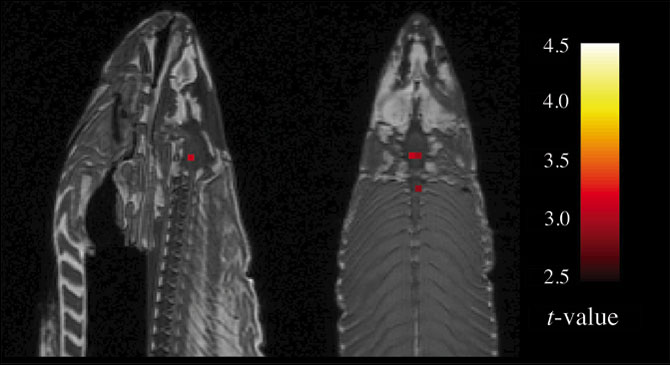

```{r setup, include=FALSE}
knitr::opts_chunk$set(echo = TRUE)
library(tidyverse)
```

## Is there a relationship?

```{r fig.width=6, fig.height=3}
ggplot(mpg) + geom_jitter(aes(x=displ, y=hwy))
```

## Is there a relationship?

```{r fig.width=6, fig.height=3}
ggplot(mpg) + geom_boxplot(aes(x=as.factor(year), y=hwy))
```

## Is there a relationship?

```{r fig.width=6, fig.height=3}
ggplot(mpg) + geom_boxplot(aes(x=drv, y=hwy))
```

## Test with all variables of interest in the model

```{r}
fit <- lm(hwy ~ displ + drv + as.factor(year), data=mpg)
anova(fit)
```

Smaller p-values indicate stronger statistical significance...

*What do these p-values actually mean though?*

## A simple example

Suppose we want to test whether the mean of `y` depends on the levels of `x`.

Let's consider 2 situations:

- There is no relationship between `x` and `y`
    
- There is a relationship between `x` and `y`

These are called the null and alternative hypotheses.

## Simulation 1: there is no relationship between `x` and `y`

We will conduct an experiment where we collect N observations, measuring `x` and `y` on each observation.

Suppose we perform this same experiment K times:

```{r}
set.seed(1)
N <- 50
K <- 100
x1 <- replicate(K, sample(c("a", "b"), N, replace=TRUE))
y1 <- rnorm(K * N, 0)
sim1 <- tibble(k=rep(1:K, each=N), x=as.factor(x1), y=y1)
```

We will simulate that there is *no* relationship between `x` and `y`.

This is called the **null hypothesis**, notated as $H_0$.

## Simulation 1: there is no relationship between `x` and `y`

```{r fig.width=6, fig.height=3}
sim1 %>% filter(k==1) %>%
  ggplot(aes(x=x, y=y)) + geom_boxplot()
```

## Simulation 1: there is no relationship between `x` and `y`

\small
```{r fig.width=6, fig.height=3}
sim1 %>% filter(k==1) %>%
  lm(y ~ x, data = .) %>% summary()
```
\normalsize

## Simulation 2: there is a relationship between `x` and `y`

We will conduct an experiment where we collect N observations, measuring `x` and `y` on each observation.

Suppose we perform this same experiment K times:

```{r}
set.seed(2)
N <- 50
K <- 100
x2 <- replicate(K, sample(c("a", "b"), N, replace=TRUE))
y2 <- rnorm(K * N, recode(x2, a=0, b=1))
sim2 <- tibble(k=rep(1:K, each=N), x=as.factor(x2), y=y2)
```

We will simulate that there *is* a relationship between `x` and `y`.

This is called the **alternative hypothesis**, notated as $H_a$.

## Simulation 2: there is a relationship between `x` and `y`

```{r fig.width=6, fig.height=3}
sim2 %>% filter(k==1) %>%
  ggplot(aes(x=x, y=y)) + geom_boxplot()
```

## Simulation 2: there is a relationship between `x` and `y`

\small
```{r fig.width=6, fig.height=3}
sim2 %>% filter(k==1) %>%
  lm(y ~ x, data = .) %>% summary()
```
\normalsize

## Does the mean of `y` depend on the levels of `x`? ($H_0$)

```{r message=FALSE, fig.width=6, fig.height=3}
sim1 %>% group_by(k, x) %>% summarize(ymean = mean(y)) %>%
  ggplot(aes(x=ymean)) + geom_histogram() + facet_wrap(~x)
```

## Does the mean of `y` depend on the levels of `x`? ($H_a$)

```{r message=FALSE, fig.width=6, fig.height=3}
sim2 %>% group_by(k, x) %>% summarize(ymean = mean(y)) %>%
  ggplot(aes(x=ymean)) + geom_histogram() + facet_wrap(~x)
```

## Simulation 1: fit the models ($H_0$)

We fit K linear models to each of the K experiments.

We extract the p-values for the overall model, which tests whether there is a relationship between `x` and `y`.

```{r message=FALSE, results='hide'}
library(modelr)
library(broom)
fit1 <- tibble(k=1:K)
fit1 <- fit1 %>%
  mutate(fit=map(k, ~ lm(y ~ x, data=filter(sim1, k == .))),
         test.statistic=map_dbl(fit, ~ glance(.)$statistic),
         p.value=map_dbl(fit, ~ glance(.)$p.value),
         coef=map_dbl(fit, ~ coef(.)["xb"]))
```

## Simulation 1: statistically significant results? ($H_0$)

```{r}
fit1 %>%
  filter(p.value < 0.05) %>%
  arrange(p.value)
```

## Is there a relationship between `x` and `y`? ($H_0$)

```{r message=FALSE, fig.height=3, fig.width=6}
filter(sim1, k == 26) %>% ggplot(aes(x, y)) + geom_boxplot()
```

## Is there a relationship between `x` and `y`? ($H_0$)

\small
```{r message=FALSE, fig.height=3, fig.width=6}
filter(sim1, k == 26) %>% lm(y ~ x, data = .) %>% summary()
```
\normalsize

## Simulation 2: fit the models ($H_a$)

We fit K linear models to each of the K experiments.

We extract the p-values for the overall model, which tests whether there is a relationship between `x` and `y`.

```{r message=FALSE, results='hide'}
fit2 <- tibble(k=1:K)
fit2 <- fit2 %>%
  mutate(fit=map(k, ~ lm(y ~ x, data=filter(sim2, k == .))),
         test.statistic=map_dbl(fit, ~ glance(.)$statistic),
         p.value=map_dbl(fit, ~ glance(.)$p.value),
         coef=map_dbl(fit, ~ coef(.)["xb"]))
```

## Simulation 2: statistically significant results? ($H_a$)

```{r}
fit2 %>%
  filter(p.value > 0.05) %>%
  arrange(desc(p.value))
```

## Is there a relationship between `x` and `y`? ($H_a$)

```{r message=FALSE, fig.height=3, fig.width=6}
filter(sim2, k == 9) %>% ggplot(aes(x, y)) + geom_boxplot()
```

## Is there a relationship between `x` and `y`? ($H_a$)

\small
```{r message=FALSE}
filter(sim2, k == 9) %>% lm(y ~ x, data = .) %>% summary()
```
\normalsize

## What is a p-value?

A p-value is defined in terms of a hypothesis test with a *__null__ hypothesis* and an *__alternative__ hypothesis*.

Typically, the null hypothesis is that **no** relationship or **no** effect exists. The alternative hypothesis is that a relationship or effect *does* exist. We often need to express this in terms of parameters:

$$H_0 : \beta = 0$$
$$H_a : \beta \neq 0$$

where $\beta$ is, for example, a coefficient in a linear model.

By performing a statistical hypothesis test, we are looking for evidence *against* the null hypothesis.

A small p-value is evidence against the null hypothesis.

## Okay, but really, what actually is a p-value?

A p-value represents the likelihood of observing the data that we did, under the assumption that the null hypothesis is true.

Specifically, it is the probability of observing a test statistic (a standardized estimate of our parameter) as extreme as the one we observed.

A small p-value means it is highly unlikely that we would observe the data that we did if the null hypothesis were actually true.

Therefore, *a small p-value is evidence against the null hypothesis.*

## Use p-values to reject (or fail to reject) the null hypothesis

We need to decide on a criterion to reject the null hypothesis. To do this, we decide a value $\alpha$ below which we will say the p-value is small enough to reject the null hypothesis.

This $\alpha$ is often called the level of statistical significance. Typical choices are 0.01, 0.05, 0.10, etc.

This $\alpha$ is also the probability we will *wrongly reject the null hypothesis*, in the case that the null hypothesis is actually true.

A statistical significance of 0.05 means that, if we performed the same experiment many, many times, and the null hypothesis is actually true, we would observe data that leads us to wrongly reject the null hypothesis ~5% of the time.

## Simulation 1: the null hypothesis ($H_0$)

```{r message=FALSE, fig.height=3, fig.width=6}
fit1 %>% select(test.statistic, p.value, coef) %>%
  gather(test.statistic, p.value, coef,
         key="type", value="value") %>%
  ggplot(aes(x=value)) + geom_histogram() +
  facet_wrap(~type, scales="free_x")
```

## Simulation 2: the alternative hypothesis ($H_a$)

```{r message=FALSE, fig.height=3, fig.width=6}
fit2 %>% select(test.statistic, p.value, coef) %>%
  gather(test.statistic, p.value, coef,
         key="type", value="value") %>%
  ggplot(aes(x=value)) + geom_histogram() +
  facet_wrap(~type, scales="free_x")
```

## Type 1 error: falsely reject the null hypothesis

```{r}
fit1 %>% filter(p.value < 0.05) %>% arrange(p.value)
```

Under the null hypothesis, we found 5 out of 100 models (5%) erroneously reject the null hypothesis at $\alpha = 0.05$.

This is called a "Type 1 error". We can control the probability of making a Type 1 error by changing $\alpha$.

## Type 2 error: falsely fail to reject the null hypothesis

\small
```{r}
fit2 %>% filter(p.value > 0.05) %>% arrange(p.value)
```

Under the alternative hypothesis, we found 10 out of 100 models (10%) fail to reject the null hypothesis at $\alpha = 0.05$.

This is called a "Type 2 error". Typically, it is difficult to directly measure or control a Type 2 error.
\normalsize

## Statistical power: correctly reject the null hypothesis

\small
```{r}
fit2 %>% filter(p.value < 0.05) %>% arrange(p.value)
```

Under the alternative hypothesis, we found 90 out of 100 models (90%) correctly reject the null hypothesis at $\alpha = 0.05$.

This is called *statistical power*. Typically, it is difficult to directly measure or control statistical power.
\normalsize

## What is significant?

\small
```{r}
fit <- lm(hwy ~ displ + drv + as.factor(year), data=mpg)
summary(fit)
```
\normalsize

## What is a p-value in linear modeling?

In the model summary, each coefficient (including each level minus one for categorical variables), has a p-value associated with it. There is also a p-value associated with the overall model.

- The p-values for each individual coefficient tests the null hypothesis that the coefficient is 0 *in this particular model* (i.e., given the other variables in the model).

- The p-value for the overall model tests the null hypothesis that *all of the coefficients are 0*. This is an overall test of significance of whether the response has any relationship with any of the explanatory variables, in any combination.

The p-values for the individual variables depend on the other variables in the model; they will change when adding or dropping variables from the model.

It is possible for the model as a whole to be "significant", but each individual coefficient is insignificant.

## Is highway mileage related to year?

```{r fig.width=6, fig.height=3}
ggplot(mpg) + geom_boxplot(aes(x=as.factor(year), y=hwy))
```

## Is highway mileage related to year? (cont'd)

\small
```{r fig.width=6, fig.height=3}
lm(hwy ~ as.factor(year), data=mpg) %>% summary()
```
\normalsize

## Is highway mileage related to year? (cont'd)

\small
```{r fig.width=6, fig.height=3}
lm(hwy ~ displ + as.factor(year), data=mpg) %>% summary()
```
\normalsize

## Is highway mileage related to year? (cont'd)

```{r fig.width=6, fig.height=3}
fit <- lm(hwy ~ displ, data=mpg)
mpg %>% add_residuals(fit) %>% ggplot() + 
  geom_boxplot(aes(x=as.factor(year), y=resid))
```

## Compare models using `anova()`

\small
We can compare models via hypothesis testing with `anova()`:

```{r}
fit1 <- lm(hwy ~ displ, data=mpg)
fit2 <- lm(hwy ~ displ + as.factor(year), data=mpg)
anova(fit1, fit2)
```

$H_0$: the **reduced model** `fit1` sufficiently explains `hwy`

$H_a$: the **full model** `fit2` explains `hwy` better than `fit1`.

We reject the null hypothesis and conclude `fit2`  is the better model.
\normalsize

## Using `anova()` to test factors

\small
This is a useful way to test factors with more than 2 levels:

```{r}
fit1 <- lm(hwy ~ displ + as.factor(year), data=mpg)
fit2 <- lm(hwy ~ displ + as.factor(year) + drv, data=mpg)
anova(fit1, fit2)
```

The model `summary()` would show multiple coefficient estimates for `drv`, but by using `anova()`, we can test the effect of the variable as a whole.

We reject the null hypothesis and conclude `fit2`  is the better model.
\normalsize

## Using `anova()` to test all variables in a model

Using `anova()` on a single model will individually test each variable:

```{r}
lm(hwy ~ displ + as.factor(year) + drv, data=mpg) %>% anova()
```

## So can we use p-values to build models?

They can be useful in determining which variables to add or drop, but this can also be tricky, as the p-values depend on the other variables in the model. In addition, we may not be concerned with statistical significance.

- A variable may be significant or not depending on which other variables are in the model

- A variable may be significant, but still need to be transformed

- A variable may become significant after transformation

- A significant variable may still not be very useful for prediction

- An insignificant variable may still be useful for prediction

Exercise caution when using and interpreting p-values!

## The danger of significance: a motivating example

Brain imaging using fMRI has become an increasingly popular technique in modern neuroscience:

- fMRI is a biomedical imaging technology that measures blood flow, which is related to brain activity

- fMRI datasets are very complex and noisy, with signal coming from thousands of voxels in each experiment

- Many papers have been published using fMRI claiming to show brain activity in reaction to some external stimulus

- Can we reliably use fMRI to deduce how the brain works?

- Are these results reproducible?

## The Dartmouth experiment


## "Methods" excerpt from neuroscientist Craig Bennett's 2010 poster

- **Subject:** One mature Atlantic Salmon (Salmo salar) participated in the fMRI study. The salmon was approximately 18 inches long, weighed 3.8 lbs, and *was not alive* at the time of scanning.

- **Task:** The task administered to the salmon involved completing an open-ended mentalizing task. The salmon was shown a series of photographs depicting human individuals in social situations with a specified emotional valence. The salmon was asked to determine what emotion the individual in the photo must have been experiencing.

- **Design:** Stimuli were presented in a block design with each photo presented for 10 seconds followed by 12 seconds of rest. A total of 15 photos were displayed. Total scan time was 5.5 minutes.

## Dead salmon can empathize with human emotions



## How was brain activity detected in a dead salmon?

- Does this mean dead fish can actually think? Are salmon zombies? (Hopefully not)

- One dead salmon should mean N = 1 for this experiment

- But fMRI collects signal from hundreds of thousands of voxels, so the number of actual data points is artificially inflated

- fMRI data is also very noisy, so data is often heavily processed by "black box" software algorithms

- Without strong statistical checks, it's easy to find a few significant signals from 150,000 voxels

## Simulation 3: is there a relationship between `y` and many `x`'s?

We will conduct an experiment where we collect N observations, measuring a single response $y$ and P different, independent variables $x_i$ on each observation.

```{r}
set.seed(3)
N <- 75
P <- 100
y <- rnorm(N)
x <- replicate(P, rnorm(N))
colnames(x) <- paste0("x", 1:P)
sim3 <- bind_cols(tibble(y=y), as_tibble(x))
```

We will simulate that there is *no* relationship between any $x_i$ and $y$.

## Simulation 3: fit a model for each variable

```{r}
fit3 <- tibble(xvar=1:P)
fit3 <- fit3 %>%
  mutate(fit=map(xvar, ~ lm(as.formula(paste0("y ~ x", .)), 
                            data=sim3)),
         test.statistic=map_dbl(fit, ~ glance(.)$statistic),
         p.value=map_dbl(fit, ~ glance(.)$p.value),
         coef=map_dbl(fit, ~ coef(.)[2]))
```

## Simulation 3: significant variables?

```{r}
fit3 %>% 
  filter(p.value < 0.05) %>%
  arrange(p.value)
```

## Simulation 3: is this significant?

```{r message=FALSE, fig.height=3, fig.width=6}
ggplot(sim3, aes(x=x57, y=y)) + geom_point() + geom_smooth()
```

## What happened?

We encountered the results of **p-hacking:**

- If you test $K$ hypotheses at $\alpha$ significance level, by random chance, approximately $\alpha K$ of them will be significant

- If you look for a significant relationship with 100 variables, you'll find approximately ~5 "significant" variables, whether those relationships actually exist or not

- There are advanced statistical methods for adjusting p-values when testing multiple hypotheses:

    + For a small number of tests, the Bonferroni correction is a safe and conservative adjustment
    
    + For a large number of tests, controlling the False Discovery Rate (FDR) is a less conservative adjustment

    + Certain families of statistical tests will have specific adjustments that some statistical packages may use automatically
  
## Bonferroni correction

\small
Given K hypothesis tests, multiply each p-value by K.

This is a conservative p-value adjustment that strongly safeguards against making any Type 1 errors at the cost of lower statistical power.

```{r}
fit3 %>%
  mutate(p.bonf = p.adjust(p.value,
                           method="bonferroni")) %>%
  arrange(p.bonf)
```
\normalsize

## False discovery rate

\small
Rather than worry about Type 1 errors on individual tests, this adjustment accepts that some number of tests will falsely reject the null hypothesis. Instead, we control the *false discovery rate*, i.e., the overall proportion of Type 1 errors.

This is a less conservative adjustment that accepts some number of false discoveries for overall greater statistical power.

```{r}
fit3 %>%
  mutate(p.fdr = p.adjust(p.value,
                          method="fdr")) %>%
  arrange(p.fdr)
```
\normalsize

## Testing vs prediction

What is the purpose of model-building?

In general, we have 2 possible goals when building a model:

- **Testing**: detect and quantify relationships between explanatory variables and a response variable

- **Prediction**: predict a response variable based on some combination of explanatory variables

We may even want to do both, but it is important to remember that these are *different* goals, and the same model may not be useful for both at once.

## Statistically significant but not predictive

```{r fig.height=3, fig.width=6}
n <- 500
ex1 <- tibble(x=rep(c("a", "b"), each=n),
              y=rnorm(2 * n, recode(x, a=0, b=1), 1.5))
ggplot(ex1, aes(x=x, y=y)) + geom_jitter(height=0)
```

## Statistically significant but not predictive

```{r message=FALSE}
anova(lm(y ~ x, data=ex1)) # test for significance

library(MASS)
fit <- lda(x ~ y, data=ex1)
mean(ex1$x == predict(fit)$class) # predictive accuracy
```

## Predictive but not statistically significant

```{r fig.height=3, fig.width=6}
n <- 500
ex2 <- tibble(x=runif(n, -1, 1),
              y=runif(n, -1, 1),
              z=ifelse(x * y > 0, "a", "b"))
ggplot(ex2, aes(x=x, y=y, color=z)) + geom_point()
```

## Predictive but not statistically significant

```{r}
anova(lm(x ~ z, data=ex2)) # not significant
anova(lm(y ~ z, data=ex2)) # not significant
```

## Model building

> All models are wrong, but some are useful.

-- George Box

\vspace{1cm}

Always consider *why* you are building a model.

- Do you want to do statistical testing?

- Do you want to do prediction?

- Do you want to do both?

The most useful model(s) may differ depending on your goals.

