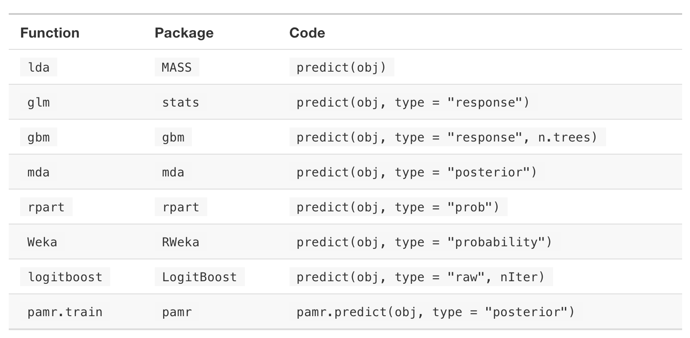
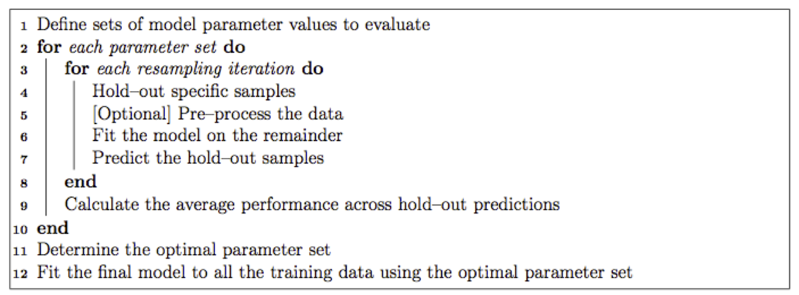

```{r setup, include=FALSE}
knitr::opts_chunk$set(echo = TRUE)
library(tidyverse)
```

## Nonlinear Models

> All models are wrong, but some are useful.

-- George Box


## Overview of modeling goals

There are two general classes of analytic methods, designed for different purposes:

- Supervised learning

    + Prediction / classification

- Unsupervised learning

    + Clustering / class discovery

Statistical inference (including testing) can be a component of either supervised or unsupervised learning methods.

So far we have focused on linear regression, which is a type of supervised learning with a continuous response.

Supervised and unsupervised methods are discussed in greater detail in dedicated courses, but we will introduce them here.

## Class comparison vs assignment vs discovery

Suppose we are interested in a categorical variable.

Then there are three general approaches we may wish to take:

- Class comparison

    + Use the categorical variable as an explanatory variable in linear regression
    
    + Use statistical tests to determine whether some continuous response depends on the level of the categorical variable
    
- Class assignment
    
    + Predict the level of a categorical response variable
    
    + Many supervised learning models are designed for classification
    
- Class discovery

    + The data is unlabeled, and you want to discover the class assignments
    
Let's focus on class assignment (classification) for now.

## Suppose we want to predict delayed flights

\small
```{r}
library(nycflights13)
flights2 <- transmute(flights,
                      month = factor(month,
                                     levels=1:12),
                      dep_time = factor(dep_time %/% 100,
                                        levels=0:23),
                      arr_delay, dep_delay,
                      origin, dest, distance)
library(modelr)
set.seed(1)  # remember to set seeds for reproducibility!
flights3 <- resample(flights2, sample(nrow(flights), 20000))
flights4 <- as_tibble(flights3) %>%
  mutate(is_delayed = arr_delay > 0,
         status = factor(ifelse(is_delayed, "Delayed", "On_Time"),
                         levels=c("On_Time", "Delayed")))
```
\normalsize

----

```{r}
select(flights4, arr_delay:status, -origin, -dest)
```

## Logistic regression and GLMs

Logistic regression is similar to linear regression, but for a categorical response. It is a type of *generalized linear model* (GLM):

$$g(y) = \beta_0 + \beta_1 x_1 + ... + \beta_n x_n$$

A generalized linear model is parameterized similarly to a linear model, but the response is related to the linear predictor via a **link function** $g(y)$.

In addition, the response variable may follow a different probability distribution than the normal distribution.

## Logistic regression

Logistic regression is defined by a **logit** link function that maps a binary response variable to continuous values:

$$logit(p) = log(\frac{p}{1 - p})$$

The response variable is expected to follow either a Bernouli distribution (response is binary), or a Binomial distribution (response is # of "success" occurences out of some total # of binary occurences).

Like linear regression, logistic regression can be used either for prediction or for statistical testing. However, due to the link function, the interpretation of model coefficients is different than for linear regression.

We will focus on prediction.

## Logistic regression for flight delays

The `glm()` function is used to fit generalized linear models.

The model is specified using a formula in the same was as `lm()`.

```{r warning=FALSE}
fit1 <- glm(status ~ month + dep_time + dep_delay + distance,
                 family=binomial(link="logit"), data=flights4)
```

We specify logistic regression by providing the model `family` as `binomial(link="logit")`.

## Logistic regression for flight delays

\small
```{r}
summary(fit1)
```
\normalsize

## Predicted probabilities

Obtain predictions as a probabilty of status = "Delayed".

\small
```{r}
flights4 %>%
  add_predictions(fit1, type="response") %>%
  select(arr_delay, is_delayed:pred)
```
\normalsize

## Prediction type

\small
The `add_predictions()` function from the **modelr** package is actually just a wrapper for the `predict()` method that most modeling methods implement.

Many models may have predict values beyond just the desired response.

We can use the  `type` argument in either `predict()` or `add_predictions()` to specify what kind of prediction is desired.

```{r}
predict(fit1, flights4, type="response") %>% head()
```

For GLM's, we need `type = "response"` because we can obtain either the linear predictions (prior to transformation by the link function) or the response predictions (after transformation by the link function).
\normalsize

## Obtaining predictions from models

Because `predict()` can be specialized for any type of model, the default help page (`?predict`) is not very useful for determining how to access different types of predictions.

Most modeling functions return an object of the same *class* as the name of the modeling function. The underlying `predict()` functions will be likewise named.

- `lm()` returns an object of type `lm`

    + `predict.lm()` is the underlying predict function

- `glm()` returns an object of type `glm`

    + `predict.glm()` is the underlying predict function

Therefore, use `?predict.glm` to see how to obtain the correct type of predictions for `glm` models.

## Predicting a binary response

\small
Many classifiers will output a numeric value (such as a probability) that must be converted into a binary value. Obtaining predictions typically requires choosing some kind of cutoff that will decide the class assignments:

```{r}
flights4 %>%
  add_predictions(fit1, type="response") %>%
  mutate(pred_status = ifelse(pred > 0.5,
                               "Delayed", "On_Time"),
         correct = status == pred_status ) %>%
  select(arr_delay, is_delayed:correct)
```
\normalsize

## Predicting a binary response (cont'd)

Note that it is important to know which class is being predicted (i.e., which is level is considered a "success").

When the binary response is a `factor`, the first level is coded as 0 ("failure") and the second level is coded as 1 ("success"). The predicted probabilities are the probabilities of "success":

```{r}
head(flights4$status)
```

"Delayed" is the second level.

Therefore, we are predicting the probability that status = "Delayed".

## Predicting a binary response (cont'd)

\small
Varying the cutoff can change the accuracy:

```{r}
flights4 %>%
  add_predictions(fit1, type="response") %>%
  mutate(pred4 = ifelse(pred > 0.4, "Delayed", "On_Time"),
         pred5 = ifelse(pred > 0.5, "Delayed", "On_Time"),
         pred6 = ifelse(pred > 0.6, "Delayed", "On_Time")) %>%
  summarize(acc4 = mean(status == pred4, na.rm=TRUE),
            acc5 = mean(status == pred5, na.rm=TRUE),
            acc6 = mean(status == pred6, na.rm=TRUE))
```
\normalsize

## Sensitivity vs specificity

Besides overall accuracy (% classified correctly), there are two types of accuracy that we can balance: **sensitivity** and **specificity**

- Sensitivity is the *true positive rate*

    + Proportion of correctly-identified positives among actual positives
    
    + If a flight will be delayed, how likely are we to classify it as delayed?

- Specificity is the *true negative rate*

    + Proportion of correctly-identified negatives among actual negatives

    + If a flight will *not* be delayed, how likely are we to classify it as *not* delayed?

These definitions depend on which class is considered the "positive" or "success" class.

It can be particularly important to pay attention to sensitivity and specificity when the response class sizes are unbalanced, as the overall accuracy can be misleading in such situations.

## Sensitivity vs specificity for delayed flights

\small
```{r}
flights5 <- flights4 %>%
  add_predictions(fit1, type="response") %>%
  mutate(pred = ifelse(pred > 0.5,
                       "Predicted Delayed",
                       "Predicted On_Time"))
table(flights5$status, flights5$pred)[,2:1] # "confusion matrix"
4606 / (3197 + 4606) # sensitivity
10917 / (10917 + 766) # specificity
```
\normalsize

## Calculating sensitivity and specificity

```{r}
yobs <- flights4$is_delayed
ypred <- predict(fit1, flights4, type="response")

sens <- function(p) {
  mean((ypred > p)[yobs], na.rm=TRUE)
}
sens(0.5)

spec <- function(p) {
  mean(!(ypred > p)[!yobs], na.rm=TRUE)
}
spec(0.5)
```

## Receiving operator characteristic (ROC) curve

Changing the cutoff probability for class assignment can affect the sensitivity and specificity.

It can be useful to calculate and plot the tradeoff between sensitivity and specificity for different cutoffs.

This is traditionally visualized as an ROC curve, which plots the *true positive rate* (sensitivity) against the *false positive rate* (1 - specificity):

```{r}
roc <- tibble(p=seq(from=0, to=1, by=0.01))
roc <- roc %>% 
  mutate(sensitivity = map_dbl(p, sens),
         specificity = map_dbl(p, spec))
```

----

```{r}
roc
```

## Plotting the ROC

A strong classifier will have an area-under-the-curve (AUC) close to 1.

```{r fig.height=3, fig.width=5}
ggplot(roc, aes(x=1 - specificity, y=sensitivity)) + geom_line()
```

## Logistic regression with many predictors

Suppose we have a classification problem with "many" predictors:

```{r}
N <- 1000
P <- 10
set.seed(2)
x <- matrix(rnorm(N * P), nrow=N, ncol=P)
colnames(x) <- paste0("x", 1:P)
y <- rbinom(N, 1, ifelse(x[,1] > 0, 0.6, 0.4))
data <- bind_cols(as_tibble(x), tibble(y=y))
```

Which predictors should we include in the model?

----

\small
```{r}
fit2 <- glm(y ~ ., data=data, family=binomial(link="logit"))
summary(fit2)
```
\normalsize

## Sparse logistic regression

The `glmnet` package fits generalized linear models with an L1 and L2 penalty on the coefficients.

The L1 penalty (the "lasso") forces many of the coefficients to be 0, essentially removing them from the model.

```{r message=FALSE}
library(glmnet)
fit3 <- glmnet(x, y, family="binomial")
```

This is a type of "sparse" model.

A sparse model uses only a small subset of the input predictors (because most of the model parameters are forced to 0 by constraints).

## Sparse coefficient estimates

Larger values of the sparsity parameter $\lambda$ force more coefficients to 0:

```{r fig.height=4, fig.width=6}
plot(fit3, xvar="lambda", label=TRUE)
```

## Cross-validation is used to select lambda

```{r fig.height=4, fig.width=6}
fit4 <- cv.glmnet(x, y)
plot(fit4)
```

## Sparse coefficients from selected model

```{r}
coef(fit4, s="lambda.min")
```

Only `x1` has a non-zero coefficient estimate.

## Using `glmnet` for sparse models

Because `glmnet` implements sparse GLM's, it can also be used for sparse linear regression, and many families of sparse generalized linear models.

- Good for automated selection of important predictor variables

- Can be useful for predictive accuracy by removing noisy predictors

- Statistical testing for sparse models is a subject of research...

- Model specification is different from `lm()` or `glm()`

    + No model formula, instead use a matrix of predictors
    
    + Categorical variables (factors) must be manually converted to indicator variables using `model.matrix()`

- Predictor variables must be on the same units scale for the sparsity constraint to make any sense

    + Predictors are automatically standardized
    
    + Coefficients are returned to original scale

- Interpretation of the regression coefficients can be difficult

## Modeling packages

One of the advantages of R is almost every conceivable machine learning or statistical model is implemented in some package.

For example:

- `e1071` : support vector machines (SVMs)

- `rpart` : classification and regression trees

- `igraph` : network analysis

- `nnet` : neural networks and multinomial regression

- `randomForest` :  random forests

- `kernlab` : kernel-based machine learning

etc.

One of the disadvantages of this is that many of these models are implemented with different function conventions and syntax.

## Modeling packages (cont'd)

For example, here are a few different ways to obtain class probabilities  from a classifier trained by different packages:



## Supervised learning with `caret`

The `caret` package attempts to provide a consistent interface to 237 machine learning models from 30+ different R packages.

The basic strategy for training machine learning methods with `caret` is as follows:



## Supervised learning with `caret` (cont'd)

The `caret` package provides the following primary functions:

- `createDataPartition()` : partitions the data into train / test split, using stratified sampling to create balanced partitions

- `preProcess()` : pre-processes the data (centering, scaling, imputating missing data, etc.)

- `trainControl()` : controls various computational aspects of how the model is trained (type of cross-validation, etc.)

- `train()` : trains a model

- `predict()` : provides a consistent way of accessing predictions from any machine learning model supported by `caret`

## Example: Sonar data

We will use the "Sonar" data from the `mlbench` package.

```{r}
library(mlbench)
data(Sonar)
```

The dataset consists of 208 observations on 60 (continuous) explanatory variables and 1 (categorical) response variable.

The 60 explanatory variables represent energy from different frequencies of sonar signals.

The goal is to predict whether the sonar signals are being bounced off a  metal cylinder ("M") or a cylindrical rock ("R").

## First two frequency channels

```{r fig.height=3, fig.width=6}
ggplot(Sonar, aes(x=V1, y=V2, color=Class)) + geom_point()
```

## Second two frequency channels

```{r fig.height=3, fig.width=6}
ggplot(Sonar, aes(x=V2, y=V3, color=Class)) + geom_point()
```

## Partition the data

First, we use `createDataPartition()` to partition the data into training and testing sets.

```{r message=FALSE}
library(caret)
set.seed(3) # reproducibility!
train_ids <- createDataPartition(Sonar$Class,
                                   p=0.75, list=FALSE)
Sonar_train <- Sonar[train_ids,]
Sonar_test <- Sonar[-train_ids,]
```

The training set will be used for cross-validation to select tuning parameters for the machine learning models.

## Train logistic regression with `caret`

We use the `train()` function to train a logistic regression model.

```{r}
glmFit <- train(Class ~ ., data=Sonar_train,
                method="glm", family=binomial(link="logit"),
                trControl=trainControl(method="none"))
```

Most machine learning models have some kind of tuning parameters, but logistic regression does not.

Therefore, we set the training control to `method="none"`, because no cross-validation is required to select tuning parameters.

---

```{r}
glmFit
```

## Confusion matrix for logistic regression

\small
```{r}
confusionMatrix(predict(glmFit, Sonar_test), Sonar_test$Class)
```
\normalsize

## Train sparse logistic regression

We can use the same `train()` function to train a `glmnet` sparse logistic regression model.

We will use repeated 5-fold cross-validation to determine the sparsity parameter $\lambda$:

```{r}
ctrl <- trainControl(method="repeatedcv", number=5, repeats=5)
grd <- expand.grid(alpha=1, lambda=exp(-10:-1))

set.seed(4) # training uses random samples for CV!
glmnetFit <- train(Class ~ ., data=Sonar_train,
                method="glmnet", family="binomial",
                trControl=ctrl, tuneGrid=grd)
```

---

\small
```{r}
glmnetFit
```
\normalsize

---

```{r fig.height=3, fig.width=6}
ggplot(glmnetFit)
```

## Check the coefficients from the best model

\small
```{r}
coef(glmnetFit$finalModel, s=glmnetFit$bestTune$lambda)
```
\normalsize

## Confusion matrix for sparse logistic regression

\small
```{r}
confusionMatrix(predict(glmnetFit, Sonar_test), Sonar_test$Class)
```
\normalsize

## Train single-hidden-layer neural network

We can use the same `train()` function to train a single-hidden layer neural network using the `nnet` package.

We will use repeated 5-fold cross-validation to determine the optimal number of units in the hidden layer:

```{r results="hide"}
ctrl <- trainControl(method="repeatedcv", number=5, repeats=5)
grd <- expand.grid(size=1:5, decay=0)

set.seed(5) # training uses random samples for CV!
nnetFit <- train(Class ~ ., data=Sonar_train,
                 method="nnet", trControl=ctrl, tuneGrid=grd)
```

---

\small
```{r}
nnetFit
```
\normalsize

---

```{r fig.height=3, fig.width=6}
ggplot(nnetFit)
```

## Confusion matrix for neural network

\small
```{r}
confusionMatrix(predict(nnetFit, Sonar_test), Sonar_test$Class)
```
\normalsize

## Other supervised learning packages: Keras

Another major machine learning package is the R interface to Keras.

The `keras` package maintained by R Studio is a high-level neural network API backed by TensorFlow, among other backends.

It provides a flexible interface for building and training many different types of neural networks.

The default installation is CPU-based, but the same models can also be trained on NVIDIA GPUs.

See https://keras.rstudio.com for more information.

## Unsupervised learning

Suppose we want to discover classes within unlabeled data.

Consider the following dataset, giving measurements on different flowers.

```{r}
head(as_tibble(iris))
iris2 <- select(iris, Sepal.Length:Petal.Width)
```

## K-means clustering

\small
```{r}
fit_kmeans <- kmeans(iris2, centers=3)
fit_kmeans
```
\normalsize

## K-means clustering (cont'd)

```{r, fig.height=3, fig.width=6}
iris %>% mutate(cluster = as.factor(fit_kmeans$cluster)) %>%
  ggplot(aes(x=Sepal.Length, y=Sepal.Width,
             color=cluster, shape=Species)) +
  geom_point()
```

## K-means clustering (cont'd)

```{r, fig.height=3, fig.width=6}
iris %>%
  mutate(cluster = as.factor(fit_kmeans$cluster)) %>%
  ggplot(aes(x=Petal.Length, y=Petal.Width,
             color=cluster, shape=Species)) +
  geom_point()
```

