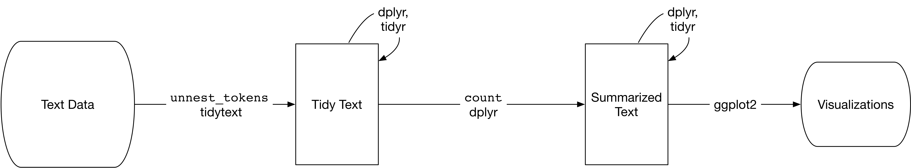

```{r setup, include=FALSE}
knitr::opts_chunk$set(echo = TRUE)
options(width=60)
library(tidyverse)
```

## Mining text data in R using `tidytext`



Book freely available at http://tidytextmining.com.

## Text data

Typically, text data is not tidy.

Often, text data is not even tabular or structured at all.

Most commonly, raw text data comes in two forms:

- **String:** Text data (e.g., emails, tweets, books) can be stored as strings and is most often first encountered and read into memory as strings, i.e., a character vector in R.

- **Corpus:** A collection of text data, typically stored as strings, where each object is distinct in some way (i.e., each string is a specific book or email or tweet), sometimes annotated with additional metadata

To analyze text data, we first need to put it into some sort of structured, tabular format.

## Tidying text data

To create a structured dataset from unstructured text data, first we must identify the basic unit of text that we need to analyze.

A **token** (or term) is a meaningful unit of text that we are interested in using for analysis; we apply **tokenization** to split the text into tokens.

Most commonly, tokens are:

- A **word** is a distinct, meaningful element of text. In English, words are easy to identify, but in other languages, word tokenization can be a more difficult process.

- An **n-gram** is a contiguous sequence of words in a text. E.g., a 2-gram or "bigram" is two consecutive words, and a 3-gram or "trigram" is three consecutive words.

## Tokenization example

```{r}
library(tokenizers)
text <- "The quick brown fox jumps over the lazy dog"
tokenize_words(text)
tokenize_ngrams(text, n=2)
```

## Tidying text data (cont'd)

After a text document has been tokenized, there are two common formats for working with the text data:

- The **tidy text** format follows the idea of "tidy data" and formats text data as "one-token-per-row". This is the format we will focus on now.

    - Each token is a row
    - Each variable is a column
    - Each value is in a cell
    
- A **document-term matrix** is a sparse matrix format used commonly in machine learning where each *unique* token (or term) is a column.

    - Each document is a row
    - Each term is a column
    - Each value is a count or frequency

These formats are each useful for different purposes. We will focus on the tidy format, because it is compatible with all of the `tidyverse` functions we have learned so far.

## Tidy text format

```{r}
emily <- c("Because I could not stop for Death -",
           "He kindly stopped for me -",
           "The Carriage held but just Ourselves -",
           "and Immortality")
```

\small
```{r echo=FALSE}
poem <- tibble(line=1:4, text=emily)
tmp <- tidytext::unnest_tokens(poem, word, text)
print(as_tibble(tmp), n=10)
```
\normalsize

## Document-term matrix

```{r}
emily <- c("Because I could not stop for Death -",
           "He kindly stopped for me -",
           "The Carriage held but just Ourselves -",
           "because Immortality")
```

```{r echo=FALSE}
poem <- tibble(line=1:4, text=emily)
tmp <- tidytext::unnest_tokens(poem, word, text)
tmp <- tidytext::cast_sparse(tmp, line, word)
as.matrix(tmp)
```

## Tokenizing with `unnest_tokens()`

Given a data frame with a column of strings, `unnest_tokens()` will tokenize the strings and return a new data frame in tidy text format.

`unnest_tokens(data, output, input, token, ...)`

- The first argument is the data

- The `output` is the name of a new column that will be created with the tokens

- The `input` is the name of the column with the strings to be tokenized

- The `token` is the type of tokenizer to use (e.g., word or n-gram)

## `unnest_tokens()` example

\small
```{r warning=FALSE}
library(tidytext)
poem <- tibble(line=1:4, text=emily)
tidy_poem <- unnest_tokens(poem, word, text)
print(tidy_poem, n=10)
```
\normalsize

## `unnest_tokens()` example (cont'd)

\small
```{r warning=FALSE}
library(tidytext)
poem <- tibble(line=1:4, text=emily)
tidy_poem <- unnest_tokens(poem, bigram, text, token="ngrams", n=2)
print(tidy_poem, n=10)
```
\normalsize

## Importing text data into R

In order to analyze text data, we must first import it into R as strings. We can do this simply with the `readLines()` function.

\small
```{r warning=FALSE}
library(tidytext)
text <- read_lines("prideprejudice.txt")
head(text, n=10)
```
\normalsize

## Preparing text data for tidying

In order to use the `unnest_tokens()` function, we need to put the string data in a data frame.

\small
```{r}
prideprejudice <- tibble(line=1:length(text), text=text)
prideprejudice
```
\normalsize

## Tidying the text data

```{r}
tidy_pride <- prideprejudice %>% 
  unnest_tokens(word, text)

tidy_pride
```

```{r echo=FALSE}
rm(prideprejudice)
```

## Check most common words

```{r}
tidy_pride %>% count(word, sort=TRUE)
```

Not very useful.

## Remove stop words

Stop words are words that are not useful for analysis.

```{r}
stop_words
```

## Check most common words again

```{r}
pride_stop <- tibble(word=c("elizabeth", "darcy", "bennet", "jane", "bingley"))

tidy_pride %>% 
  anti_join(stop_words, by="word") %>%
  anti_join(pride_stop, by="word") %>%
  count(word, sort=TRUE)
```

## Visualize the most common words

```{r prideprejudice, eval=FALSE}
tidy_pride %>% 
  anti_join(stop_words, by="word") %>%
  count(word, sort=TRUE) %>%
  filter(n > 150) %>%
  mutate(word = reorder(word, n)) %>%
  ggplot(aes(x=word, y=n)) +
  geom_col() +
  coord_flip()
```

What does `reorder()` do here?

---

```{r prideprejudice, echo=FALSE, fig.width=5, fig.height=3}
```

## Analyzing all Jane Austen novels

Now that we know how to import and tidy raw text data, we will use data from the `janeaustenr` package, which includes the full text from all six of Jane Austen's completed, published novels.

\small
```{r}
library(janeaustenr)
austen_books()
```
\normalsize

## Tidying the works of Jane Austen

\small
```{r}
library(stringr)
tidy_austen <- austen_books() %>%
  group_by(book) %>%
  mutate(linenumber = row_number(),
         chapter = cumsum(str_detect(text,
                                     regex("^chapter [\\divxlc]",
                                           ignore_case = TRUE)))) %>%
  ungroup() %>%
  unnest_tokens(word, text)
```
\normalsize

---

```{r}
tidy_austen
```

## Visualize the most common words in Jane Austen

```{r austen1, eval=FALSE}
tidy_austen %>% 
  anti_join(stop_words, by="word") %>%
  count(word, sort=TRUE) %>%
  top_n(15) %>%
  mutate(word = reorder(word, n)) %>%
  ggplot(aes(x=word, y=n)) +
  geom_col() +
  coord_flip()
```

---

```{r austen1, echo=FALSE, fig.width=5, fig.height=3}
```

## Visualize the most common words by novel

```{r austen2, eval=FALSE}
tidy_austen %>% 
  anti_join(stop_words, by="word") %>%
  count(book, word, sort=TRUE) %>%
  mutate(word = factor(word, levels = rev(unique(word)))) %>%
  group_by(book) %>% 
  top_n(15) %>% 
  ungroup() %>%
  ggplot(aes(word, n, fill = book)) +
  geom_col(show.legend = FALSE) +
  labs(x = NULL, y = "n") +
  facet_wrap(~book, ncol = 3, scales = "free") +
  coord_flip()
```

---

```{r austen2, echo=FALSE, fig.width=6, fig.height=4}
```

## Analyze word frequency

When analyzing a corpus, we may want to identify words that are the most important to each document. However, looking at frequency alone may not help, since words that appear very commonly across all documents will be ranked highly, yet are not very important to any particular document.

Instead, we could give a weighting to words that are used most frequently in some documents, and not as much in others. The *inverse document frequency* (idf) does this by downweighting words that are very common across all documents in a corpus.

$$idf(\text{term}) = \ln{\left(\frac{n_{\text{documents}}}{n_{\text{documents containing term}}}\right)}$$

The *idf* can be combined with the *tf*, or term frequency (by multiplying them together) to calculate the *tf-idf*, which measures the importance of a term to a particular document in a corpus.

Although it has no basis in statistics or information theory, the *tf-idf* is a commonly used heuristic measure.

## Calculate term frequency

```{r}
austen_words <- tidy_austen %>% 
  count(book, word, sort=TRUE)

austen_totals <- austen_words %>% 
  group_by(book) %>%
  summarise(total = sum(n))

austen_words <- austen_words %>%
  left_join(austen_totals) %>%
  mutate(tf = n / total)
```

---

```{r}
austen_words
```

## Calculate inverse document frequency

```{r}
austen_words <- austen_words %>%
  mutate(n_doc = n_distinct(book)) %>%
  group_by(word) %>%
  mutate(idf = log(n_doc / n()),
         tf_idf = tf * idf) %>%
  select(-n_doc, -total) %>%
  ungroup()
```

---

```{r}
austen_words
```

---

```{r}
austen_words %>% arrange(desc(tf_idf))
```

## Calculating tf-idf with `bind_tf_idf()`

Alternatively, the *tf-idf* for each term can be calculated easily by using the `bind_tf_idf()` function provided by the `tidytext` package.

`bind_tf_idf(data, term, document, n)`

- The first argument is the data

- The following arguments give the name of the columns that identify the term, document, and counts

```{r}
austen_words_tf <- tidy_austen %>% 
  count(book, word, sort=TRUE) %>%
  bind_tf_idf(word, book, n)
```

---

```{r}
austen_words_tf %>% arrange(desc(tf_idf))
```

## Visualizing the tf-idf of Jane Austen novels

```{r austen3, eval=FALSE}
austen_words %>%
  arrange(desc(tf_idf)) %>%
  mutate(word = factor(word, levels = rev(unique(word)))) %>% 
  group_by(book) %>% 
  top_n(15) %>% 
  ungroup() %>%
  ggplot(aes(word, tf_idf, fill = book)) +
  geom_col(show.legend = FALSE) +
  labs(x = NULL, y = "tf-idf") +
  facet_wrap(~book, ncol = 3, scales = "free") +
  coord_flip()
```

---

```{r austen3, echo=FALSE, fig.width=6, fig.height=4}
```

## Analyzing n-grams

So far we have looked at the importance of individual words, but not the relationships between them. We can investigate relationships between words (e.g., which words tend to immediately follow others, or what words tend to co-occur in a corpus) by tokenizing on n-grams. We will focus on n = 2, or bigrams.

```{r}
austen_bigrams <- austen_books() %>%
  unnest_tokens(bigram, text, token = "ngrams", n = 2)
```

---

```{r}
austen_bigrams
```

## Check most common bigrams in Jane Austen

```{r}
austen_bigrams %>% count(bigram, sort=TRUE)
```

## Separate bigrams and remove stop words

```{r}
austen_bigrams <- austen_bigrams %>%
  separate(bigram, c("word1", "word2"), sep = " ")

austen_bigrams <- austen_bigrams %>%
  filter(!word1 %in% stop_words$word) %>%
  filter(!word2 %in% stop_words$word)
```

## Check most common bigrams again

```{r}
austen_bigrams %>% count(word1, word2, sort=TRUE)
```

## Check most common use of "miss"

```{r}
austen_bigrams %>%
  filter(word1 == "miss") %>%
  count(word1, word2, sort=TRUE)
```

## Calculate tf-idf for bigrams

```{r}
austen_bigrams_tf <- austen_bigrams %>%
  unite(bigram, word1, word2, sep = " ") %>%
  count(book, bigram) %>%
  bind_tf_idf(bigram, book, n) %>%
  arrange(desc(tf_idf))
```

---

```{r}
austen_bigrams_tf
```

## Visualize bigrams by tf-idf

```{r austen4, eval=FALSE}
austen_bigrams_tf %>%
  arrange(desc(tf_idf)) %>%
  mutate(bigram = factor(bigram, levels = rev(unique(bigram)))) %>% 
  group_by(book) %>% 
  top_n(15) %>% 
  ungroup() %>%
  ggplot(aes(bigram, tf_idf, fill = book)) +
  geom_col(show.legend = FALSE) +
  labs(x = NULL, y = "tf-idf") +
  facet_wrap(~book, ncol = 3, scales = "free") +
  coord_flip()
```

---

```{r austen4, echo=FALSE, fig.width=6, fig.height=4}
```

## Analyzing bigrams with graphs

Rather than visualize the most common bigrams by their counts or term frequencies, we can instead visualize them as a graph. Here, we use "graph" not in the sense of visualization, but to refer to a network of connected nodes.

A graph can be constructed from a tidy object by considering the *edges* between nodes as the observations (rows), and the variables (columns) are:

- **from** the node that the edge is coming from

- **to** the node that the edge is going toward

- **weight** the weight of the edge

In our case, each bigram represents an edge in the network, each word is a node, and the weights are the bigram counts.

We can use the `igraph` package to construct the graph.

## Creating a graph from bigrams

\small
```{r warning=FALSE, message=FALSE}
library(igraph)
austen_graph <- austen_bigrams %>% 
  count(word1, word2, sort=TRUE) %>%
  filter(n > 20) %>%
  graph_from_data_frame()

austen_graph
```
\normalsize

## Visualizing n-gram graphs

We can use the `ggraph` package to visualize the graph of bigrams that we just made.

```{r warning=FALSE}
library(ggraph)
```

```{r austen5, eval=FALSE}
set.seed(1)
ggraph(austen_graph) +
  geom_edge_link() +
  geom_node_point() +
  geom_node_text(aes(label = name), vjust = 1, hjust = 1)
```

---

```{r austen5, echo=FALSE, fig.width=8, fig.height=6}
```
