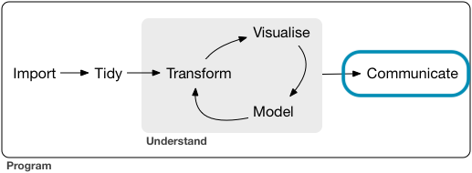
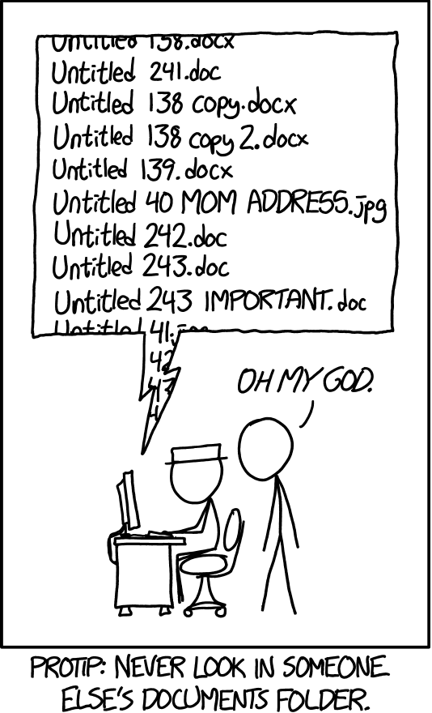

```{r setup, include=FALSE}
knitr::opts_chunk$set(echo = TRUE)
library(tidyverse)
```

## Communicating reproducible results



\small
So far, we have been focusing on *exploratory* plots and tools for data *analysis*.

Just as important are plots for *communication* and tools for disseminating *reproducible results*.
\normalsize

## Communication 101

An important part of your responsibilities as a data scientist is communicating, presenting, and *interpreting* your results to others.

Often, your audience will not have the same background knowledge as you regarding the data, the statistical and machine learning methods involved in their analysis, or the proper interpretation of your results.

Questions to consider:

- Who is your audience?

- What is the goal of your presentation or report?

- How can you best communicate the most relevant results?

- Why should your results be meaningful to this audience?

## Good enough for EDA

```{r message=FALSE, fig.height=3, fig.width=6}
ggplot(mpg, aes(x=displ, y=hwy)) + 
  geom_point(aes(color=class)) + geom_smooth()
```

## Titles and labeled axes are good

```{r message=FALSE, fig.height=3, fig.width=6}
ggplot(mpg, aes(x=displ, y=hwy)) + 
  geom_point(aes(color=class)) + geom_smooth() +
  labs(title="Highway mileage vs Engine size",
       x="Engine size", y="Highway mileage")
```

## Informative titles are even better

\small
```{r message=FALSE, fig.height=3, fig.width=6}
ggplot(mpg, aes(x=displ, y=hwy)) + 
  geom_point(aes(color=class)) + geom_smooth() +
  labs(title="Cars with larger engines get worse mileage",
       x="Engine size (liters)", y="Highway mileage (per gallon)")
```
\normalsize

## Use annotations to help interpret results

Use titles (for plots, slides, section headers, etc.) to help interpret your results in tables, plots, etc.

- Don't just say what a plot *is*

- Use titles and annotations to tell us what a plot *means*

Interpreting plots and tables of statistics is a skill.

Presenting a visualization without accompanying interpretation forces your audience to take a longer time reading the plot.

## Scales and legends

In addition to titles, use appropriate scales and legends for your data.

- Although defaults are typically good, setting scales manually is sometimes necessary

- Consider what colors best represent what you are trying to show

    + E.g., red for "hot" versus blue for "cold"
    
    + Also consider color-blindness and black-and-white printing
    
- Consider mapping multiple aesthetics to the same variable to make it easier to distinguish categorical levels

- Consider the ordering of levels for categorical data

- Consider the tick breaks and scales of numeric axes

See the "Graphics for communication" chapter in *R for Data Science* for many options for adjusting `ggplot2` graphics.

## Larger diamonds are more expensive (log transformation)

```{r message=FALSE, fig.height=3, fig.width=6}
ggplot(diamonds, aes(x=log2(carat), y=log10(price))) +
  geom_bin2d() + geom_smooth()
```

## Larger diamonds are more expensive (log scales)

\small
```{r message=FALSE, fig.height=3, fig.width=6}
ggplot(diamonds, aes(x=carat, y=price)) +
  geom_bin2d() + geom_smooth() + scale_x_log10() + scale_y_log10() +
  labs(x="Size (carats)", y="Price (USD)")
```
\normalsize

## RColorBrewer provides hand-tuned color scales

Palettes from the `RColorBrewer` package can be used with `ggplot2` color scales. These palettes have been hand-tuned to work with colorblindness.

\small
```{r message=FALSE, fig.height=3, fig.width=6}
ggplot(mpg, aes(x=displ, y=hwy, color=drv, shape=drv)) + 
  geom_point() + scale_color_brewer(palette="Set1") +
  labs(title="Cars with larger engines get worse mileage",
       x="Engine size (liters)", y="Highway mileage (per gallon)")
```
\normalsize

## Posthoc annotations

The *data content* of your plots should be reproducible, but pixel-perfect reproducibility isn't as important.

- Don't dismiss the ability to edit plots in external software after generating them

- Generating plots without static annotations can be helpful, so you can add them back in later

    + You may want to dynamically add axis labels and titles in Powerpoint/Keynote, etc.
    
    + Break a complex visualization into individual components you can move and resize on a slide

Always present your visualizations so they are clearly and easily interpretable by your audience!

## Lies, damned lies, and statistics

\small
```{r message=FALSE, fig.height=3, fig.width=6}
mpg %>% group_by(year) %>%
  summarize(hwy=median(hwy)) %>%
  ggplot(aes(x=as.factor(year), y=hwy)) + geom_col() + 
  # coord_cartesian(ylim=c(23.5, 25.5)) +
  labs(title="Recently-manufactured cars get much worse mileage",
       x="Year of manufacture", y="Highway mileage (per gallon)")
```
\normalsize

## Use your plots to make a point

"With great power comes great responsibility."

-- Uncle Ben

You can dramatically change the way your audience interprets your results based on how you present them.

- Consider how you can use present your visualizations (through titles, annotations, scales, transformations, etc.) so that they are easy to interpret correctly.

- Conversely, you have a responsibility not to be misleading in how you present your results.

Friends don't let friends hack p-values!

## General tips for presentations and reports

- Always consider your audience

    + Sometimes knowledge can be assumed
    
    + Sometimes you need to define your methods and terminology
    
- Always present polished results

    + Visualizations should be clearly and easily interpretable
    
    + Don't show raw printouts and code output
    
- Always be as specific as appropriate

    + A sensible description of a variable is more informative than its name in the dataset
    
    + Your methods and results should be reproducible
    
    + But some details belong in an appendix or supplementary material
    
- Tell a story

    + What is the goal of this analysis?
    
    + Why should we care?

And always proofread your professional writing!

## Exporting plots with `ggsave()`

You can use `ggsave()` to export plots created with `ggplot2`.

\small
```{r eval=FALSE}
ggplot(mpg, aes(x=displ, y=hwy)) + 
  geom_point(aes(color=class)) + geom_smooth() +
  labs(title="Cars with larger engines get worse mileage",
       x="Engine size (liters)", y="Highway mileage (per gallon)")
ggsave("mpg.pdf", width=6, height=3)
```
\normalsize

## Exporting plots with `pdf()`

Using graphics devices like `pdf()`, `png()`, and `tiff()` is another way to export any graphics generated by R.

\small
```{r eval=FALSE}
pdf("mpg.pdf", width=6, height=3)
ggplot(mpg, aes(x=displ, y=hwy)) + 
  geom_point(aes(color=class)) + geom_smooth() +
  labs(title="Cars with larger engines get worse mileage",
       x="Engine size (liters)", y="Highway mileage (per gallon)")
dev.off()
```
\normalsize

## Is this you?



## What to do about it?

An important part of data science is that data, code, visualizations, and analyses should all be reproducible.

Code is more reproducible than point-and-click interfaces, and using formats such as R Markdown ensures that results in reports are reproducible.

But how can we manage our data, code, and analyses in a reproducible way?

## Version control

Version control software like **git** can help.

- Automatically tracks changes made to documents and projects

- Keeps a history log of all major and minor changes

- Allows reverting to earlier versions

- Compare different versions of documents

- Share and sync projects between people

## git and Github

**git** is one of the most common version control tools. It is a program that allows you to create repositories (or repos) wherein every document in it is tracked. Git repos can exist on your personal computer, on a server on the internet, or (usually) both.

**Github** is an online service that hosts git respositories for free (if they're public) or a small fee (if they're private). You can use GitHub to host and share your coding projects with the world.

## Initializing a git repository

Although there exist GUIs for git, and many IDEs including RStudio feature git/GitHub integration, we will focus on understanding the fundamentals of the command line version.

It's easy to initialize a git repository on your computer.

Assuming you have git installed, just navigate to the directory that you want to track in your Terminal, and type:

```
git init
```

All of the files and subdirectories in that directory are now tracked by git.

However, it's still your responsibility to tell git when you make changes that you want git to record.

## Understanding git

To understand git, it's helpful to understand the four areas that git operates:

\center

{width=65%}\


- The **working directory** is the actual directory on your computer where you're working

- The **staging area** is a set of files in your working directory that you've changed since your last *commit*

- Your **local repository** is the version of the git repo on your computer. It includes the files you can see in it, but also includes all the files and changes that have ever been part of your project history. These are hidden in an invisible `.git` directory that git uses.

- The **remote repository** is a version of the repository hosted on a remote site such as GitHub. This is where you share your code publicly. If you are working on a team, this is where the canonical version of your project lives while you work on your local versions.

## Git workflow

Four basic commands will give you the bare minimum you need to navigate your git workflow:

- `git add` will add new or changed files to the *staging area*

    + `git add --all` will add all new or changed files to the staging area

- `git commit` will create a snapshot of the current state of your repo, along with a SHA-1 identifier, and a commit message

    + `git commit -m "my commit message"` is a shortcut for including your commit message with the command
  
- `git push <name of remote> <name of branch>` will push your most recent commits from your local repo to a remote repo

    + Typically `git push origin master`

- `git pull <name of remote> <name of branch>` will pull the most recent commits from a remote repo to your local repo

    + Typically `git pull origin master`

## Git workflow visualized


## A typicaly git workflow

A simple git/GitHub workflow when collaborating on a project with a team looks something like this:

1. Make changes to your local repo (edit code, add files, etc.)

2. Stage those changes for commit with `git add`

3. Commit those changes to your local repo with `git commit`

4. Grab any changes by your teammates from GitHub with `git pull`

5. Push your own changes to GitHub with `git push`

6. Repeat steps 1-5

While git will automatically merge as many changes as it can, when it finds conflicting changes, you will have to resolve these yourself, and then commit those changes.

## Using git branches to manage projects

Once you have the basics down, "branches" become a useful way to manage different aspects of a complex project.


## In the interest of reproducibility

\tiny
```{r}
sessionInfo()
```
\normalsize
