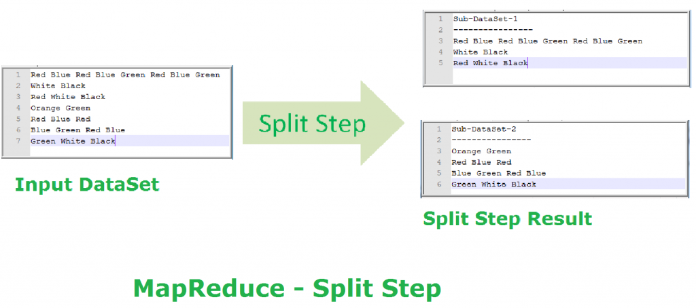

```{r setup, include=FALSE}
knitr::opts_chunk$set(echo = TRUE)
```

## Motivating example

What if `flights` was very large? E.g., multiple years, or more airports?

\small
```{r}
library(modelr)
library(nycflights13)

lmFit <- function(data) {
  lm(arr_delay ~ dep_delay, data=data)
}

fit1 <- lmFit(flights)
fit1
```
\normalsize

## How can we fit this in parallel?

The easiest problems to parallelize are **embarrassingly parallel**:

- Independent tasks requiring no communication between them

- Data can be split into similarly-sized, independent subsets

- Almost anything that can be done with `lapply()` or `purrr::map()`

So how can we parallelize fitting a linear model to a single, large `flights` dataset?

- Fit a separate model for each year?

- Fit a separate model for each airport?

- Fit separate models to random samples (bootstrap) or random subsets (D&R)?

## Divide and Recombine (D&R)

Consider a linear regression model with $n$ observations:

$$Y = X\beta + \epsilon$$

Divide the the data into $r$ subsets of $m$ observations each, so $n = rm$.

For each subset $s$, the least-squares estimate is:

$$\dot{\beta}_s = (X_s'X_s)^{-1}X_sY_s$$

The D&R estimate for the coefficients $\beta$  is then:

$$\ddot{\beta} = \frac{1}{r}\sum_{s=1}^r \dot{\beta}_s$$

Source: http://ml.stat.purdue.edu/hafen/preprints/Guha_Stat_2012.pdf

## Partition the data into subsets

First, we partition the data into subsets.

```{r}
n <- 10
set.seed(1)
partitions <- rep(1/n, n)
names(partitions) <- seq_len(n)

flights2 <- resample_partition(flights, partitions)
```

We also define a function for obtaining the D&R coefficients from the models.

```{r}
DnR_coef <- function(x) {
  rowSums(sapply(x, coef) / length(x))
}
```

## Fit the data on the models (single-threaded)

```{r}
fitn <- lapply(flights2, lmFit)

coef(fit1)
DnR_coef(fitn)
```

## The `parallel` package

The `parallel` package integrates two approaches to parallel and distributed computing in R.

- Multicore forking creates clones of the original R session

- Multiprocess SOCKET clusters create new R sessions

```{r}
library(parallel)
detectCores()
```

## Multicore forking approach

- Clones the original R session to create worker processes

- Requires OS forking support, only works on macOS and Linux

- Only works on a single machine, not over a network cluster

- Minimal overhead in communication between processes

- Worker processes share memory with the original R session

    + In theory, this is memory-efficient, as the data is shared and does not need to be exported or duplicated from the host R session
    
    + In practice, forked memory management is OS-dependent, and R's garbage collection frequently triggers duplication of objects

## Using forking

`mclapply()` provides a multicore version of `lapply()` that uses forking.

```{r}
fitmc <- mclapply(flights2, lmFit)

coef(fit1)
DnR_coef(fitmc)
```

You can create a forked cluster manually with `makeForkCluster()`.

## Multiprocess SOCKET cluster approach

- Create new worker R sessions manually

- Relies on built-in R networking utilities, works on all OS's

- Works over a network cluster

- Communication between processes depends on network

- Worker processes are independent, fresh R sessions

    + Each process has an independent, separate memory space

    + Data must be moved manually to the worker processes
    
    + Libraries must be reloaded

## Using sockets

Creating a SOCKET cluster works on all operating systems.

```{r}
cl <- makeCluster(detectCores())
result <- clusterEvalQ(cl, library(modelr))
fitcl <- parLapply(cl, flights2, lmFit)
stopCluster(cl)

coef(fit1)
DnR_coef(fitcl)
```

## Linear regression on a larger dataset

Suppose we want to run linear regression on a slightly larger dataset with more predictors.

\small
```{r eval=FALSE}
n <- 1e6
p <- 9
b <- runif(p)
names(b) <- paste0("x", 1:p)
data <- vector("list", length=p + 1)
data[[p + 1]] <- rnorm(n)
for ( i in 1:p ) {
  xi <- rnorm(n)
  data[[i]] <- xi
  data[[p + 1]] <- data[[p + 1]] + xi * b[i]
}
data <- as.data.frame(data)
names(data) <- c(names(b), "y")
library(pryr)
object_size(data)
```
\normalsize

## Linear regression on a larger dataset (cont'd)

To see how much memory is takes to run linear regression on this dataset, let's create a `mem_overhead` function.

```{r eval=FALSE}
mem_max <- function() {
  pryr:::show_bytes(sum(gc()[,6] * c(pryr:::node_size(), 8)))
}

mem_overhead <- function(code) {
  gc(reset=TRUE)
  expr <- substitute(code)
  eval(expr, parent.frame())
  rm(code, expr)
  finish <- mem_used()
  pryr:::show_bytes(mem_max() - finish)
}
```

## Linear regression on large dataset (cont'd)

```{r eval=FALSE}
mem_overhead(fit2 <- lm(y ~ ., data=data))
coef(fit2)
```

This typically uses several times the memory as the original dataset.

We can see that fitting a linear model with `lm()` on a large dataset uses quite a lot of memory overhead. Imagine if this dataset were gigabytes large instead of only 80 MB.

## Partition the dataset for D&R

```{r eval=FALSE}
library(modelr)
n <- 10
partitions <- rep(1/n, n)
names(partitions) <- seq_len(n)

data2 <- resample_partition(data, partitions)
```

## D&R regression using `lapply`

```{r eval=FALSE}
lmFit2 <- function(data) {
  lm(y ~ ., data=data)
}
mem_overhead(fit2dr <- lapply(data2, lmFit2))
coef(fit2)
DnR_coef(fit2dr)
```

## D&R regression using `parLapply`

```{r eval=FALSE}
cl <- makePSOCKcluster(detectCores())
result <- clusterEvalQ(cl, library(modelr))
fit2cl <- parLapply(cl, data2, lmFit2)
stopCluster(cl)
DnR_coef(fit2cl)
```

It takes significant overhead to export the data to each additional R session, especially if the data is very large.

On a single machine, fitting the model in parallel this way ends up taking *more* memory, because the data is loaded in multiple R sessions.

It would be great if we coudl share the same dataset between R sessions in a portable and reliable way.

## Get indices of the subsets

We want to use a data structure that we can share between R sessions without having to copy the whole object. That means our `resample` objects from `resample_partition()` won't work anymore. However, we can still use the same subsets by extracting the row indices.

```{r eval=FALSE}
subidx <- sapply(data2, function(rs) rs$idx)
str(subidx)
```

## Packages for on-disk data

In additional to traditional RDBMS's, there are a growing number of packages dedicated to working with large datasets on-disk in R.

- `bigmemory` on CRAN
    + Uses shared memory to allow sharing of in-memory objects between R sessions
    + Also supports file-backed matrices in flat files
    + Extended by `bigalgebra` and `biganalytics` packages

- `ff` on CRAN
    + Uses on-disk flat files for data storage
    + Extended by `ffbase`
    
- `HDF5Array` on Bioconductor
    + Uses HDF5 files for data storage
    + Supports delayed block processing

- `matter` on Bioconductor
    + Uses on-disk files for data storage
    + Supports custom formats and some delayed operations

## Using `ff`

With __ff__, we can use the `as.ffdf()` function to coerce our dataset into an `ff` data frame. This writes the data to disk an an efficiently-accessed binary flat file.

```{r eval=FALSE}
library(ff)
data.ff <- as.ffdf(data)
data.ff
```

## D&R regression with `ff`

Because __ff__ only needs to know the filename and its other metadata (such as `dim` and `dimnames`) are stored in R, it can be serialized to other R sessions easily.

```{r eval=FALSE}
cl <- makePSOCKcluster(detectCores())
clusterExport(cl, "data.ff")
result <- clusterEvalQ(cl, library(ff))
fit2ff <- parLapply(cl, subidx, function(i) {
  subdata <- as.data.frame(data.ff[i,])
  lm(y ~ ., data=subdata)
})
stopCluster(cl)
DnR_coef(fit2ff)
```

## Considerations for out-of-memory data management

Can you use a RDBMS?

- Databases like MySQL and SQLite excel at managing data on disk
    
- Use independent file connections to access a database in parallel
    
- What operations are supported?

    + Often optimized for data transformation such joins and summarization
    
    + Not designed for linear algebra
    
When using a binary flat-file-based (or HDF5-based) approach:

- What types of data are allowed? (Strings are often forbidden)

- How is the data stored?

    + Matrices are typically stored in "column-major" order in R, and packages like `bigmemory` and `ff` use the same approach on-disk
    
    + Accessing data in one direction (columns) may be faster than accessing in another direction (rows)
    
- What operations are supported?

    + Often optimized for fast, random access rather than data manipulation
    
    + Some delayed operations may be supported (`matter` and `HDF5Array`)
    
    + Linear algebra may be supported

## Considerations for parallel memory management

There is often a trade-off between CPU efficiency and memory efficiency.

For example, consider k-fold cross-validation:

- This problem is easily parallelized, as the model for each fold is trained independently of the others

- But parallel cross-validation may very memory inefficent, as each fold actually uses the whole dataset

- Parallel k-fold cross-validation is potentially up to k-times faster, but may be memory-bound in R

- Sharing the same copy of the data between R sessions only really helps if the algorithm has low memory overhead

- For example `lm()` is very memory-inefficient, but `biglm()` from the `biglm` package tries to use less memory

Always consider how much speed you may gain by parallelizing code versus the total memory that may be used in a parallel implementation.

Try to use file-based formats (e.g., databases) that can be shared between R sessions in parallel when possible.

## MapReduce

**MapReduce is a programming model for parallel, distributed processing on big data.**

Its name derives from the `Map()` and `Reduce()` functions used in functional programming languages such as R and LISP.

MapReduce was developed by Google as a specialization **"split-apply-combine"** strategy for data analysis.

The most well-known and widely-used implementation of MapReduce is Hadoop, but MapReduce is a general programming strategy that can be implemented in any langauge.

## Split-Apply-Combine

Split-apply-combine, as described by Hadley Wickam:

> Many data analysis problems involve the application of a split-apply-combine strategy, where you break up a big problem into manageable pieces, operate on each piece independently and then put all the pieces back together.

-- Wickam 2011

\small
Source: https://www.jstatsoft.org/index.php/jss/article/view/v040i01/v40i01.pdf
\normalsize

## Split-Apply-Combine (cont'd)

You have already been using split-apply-combine in your data analyses whenever you use `dplyr`!

Consider the following code that computes the average distance flown to each destination in the `flights` dataset:

```{r eval=FALSE}
library(dplyr)
flights %>%
  group_by(dest) %>%
  summarise(mean(distance, na.rm=TRUE))
```

First, we **split** the dataset using `group_by()`.

Next, we **apply** the function `mean()` to each group. 

Finally, we **combine** the results in `summarise()`.

## MapReduce (cont'd)

At a high level, MapReduce **splits** the input data into subsets.

Then a Map() function is **applied** to each subset, and outputs key-value pairs.

A shuffle step organizes the output results by their keys.

Then a Reduce() function is applied to **combine** the values for each key.

The final results are then collated and returned.

## `Map()` and `Reduce()`

\small
The name derives from the Map() and Reduce() functions commonly found in functional programming languages such as R and LISP.

```{r}
x <- list(1:10, 11:20, 21:30)
y <- list(1, 2, 3)

map.out <- Map("+", x, y) # add elements of 'x' and 'y'
map.out

reduce.out <- Reduce("+", map.out) # sum each element
reduce.out
```
\normalsize

## MapReduce visualized

Because MapReduce is typically performed in a distributed manner, there is no way of knowing what part of the data will be processed on what node, so MapReduce passes data as key-value pairs, and uses the keys to organize where intermediate results need to go.


## Map step

In the Map step, the data is split into subsets.

The data is then passed to a `Map()` function as key-value pairs.

The `Map()` function processes each key-value pair and outputs a list of new key-value pairs.

```{}
Map(k1,v1) → list(k2,v2)
```

## Shuffle step

In the Shuffle step, the output of the Map step is sorted by key.

All of the values with the same key are grouped together.

These intermediate key-value pairs are then passed to the Reduce step.

```{}
Shuffle(list(list(k2,v2))) → list(k2,list(v2))
```

## Reduce step

In the Reduce step, the intermediate key-value pairs are passed to the `Reduce()` function.

The `Reduce()` function processes the values for the input key, and outputs a final output value for that same key

```{}
Reduce(k2, list (v2)) → list(v3)
```

## Word count example

Suppose we want to count the number of each word in a document.


## Word count example (cont'd)

This is the final output we would expect. How does MapReduce get us here?


## Word count example: Map step (split)

First, the data is split into subsets.



## Word count example: Map step (Map function)

The Map() function outputs keys (words) and values (1). Later, the Reduce() function will sum these values up to get the count for each word.


## Word count example: Shuffle step (merge)

The output of each Map() function are merged together.


## Word count example: Shuffle step (sort)

The merged output from the Map() functions are sorted by key.


## Word count example: Reduce step (Reduce function)

The Reduce() function sums the values for each key to get the word count.


