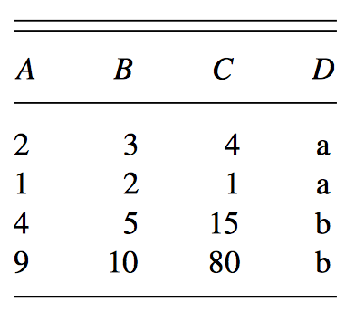
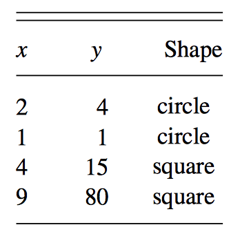
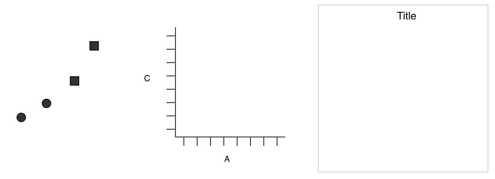
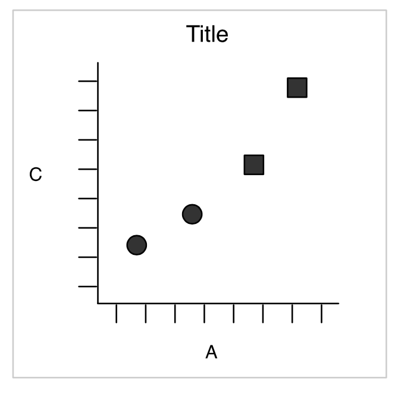
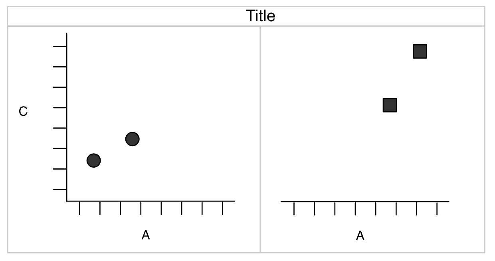

```{r setup, include=FALSE}
knitr::opts_chunk$set(echo = TRUE)
```

## What is a graphic?

## What is a graphic?

Common statistical plots:

- Scatter plot

- Line plot

- Box plot

- Histogram

- Bar plot

## How are these plots related?

Common statistical plots:

- Scatter plot

- Line plot

- Box plot

- Histogram

- Bar plot

What are their basic building blocks?

## How are these plots related?

- Scatter plot
    - Maps variables to x- and y-axes
    - Uses points to represent each observation

- Line plot    
    - Maps variables to x- and y-axes
    - Uses lines to connect each observation

- Box plot
    - Maps 5-number summary (min, lower-hinge, median, upper-hinge, max) to y-axis
    - Uses shapes to (boxes and whiskers) to represent these

- Histogram
    - Maps bins to x-axis and frequencies to y-axis
    - Uses bars to represent these

- Bar plot
    - Maps categorical variable to x-axis and counts (usually) to y-axis
    - Uses bars to represent these

## What are the common elements?

## What are the common elements?

- Some kind of data

- Mappings from data to aspects of the plot ("aesthetics")

- Geometric objects

- Potentially, statistical transformation

- Coordinate systems

We're on to something...

## Can we break a plot into its basic components?

Consider a simple dataset:

{width=40%}

We wish to create a scatter plot of A versus C.

## Mapping aesthetics

We map variable A to x, variable C to y, and shape to D.

{width=40%}

## Building a plot

We have (1) geometric objects, (2) scales and coordinate system, and (3) plot annotations:

{width=90%}

## Building a plot (1)

And we have a plot:

{width=50%}

## Building a plot (2)

We can create a more complicated plot by *faceting* on a variable:

{width=90%}

Faceting splits the data into subsets and creates subplots for each subset.

## What about more complicated plots?

- Overlaying plots on top of each other

- Different datasets on the same plot

- Etc.

## A Layered "Grammer of Graphics"

Components of a plot:

- Default dataset and set of mappings from variables to aesthetics

- One or more layers, each having:

    - A geometric object
    
    - A statistical transformation
    
    - A position adjustment
    
    - (Optional) A dataset
    
    - (Optional) A set of aesthetic mappings
    
- A scale for each mapped aesthetic

- A coordinate system

- A facet specification


## A simple example (revisited)

```{r}
simple <- data.frame(A=c(2, 1, 4, 9),
                    B=c(3, 2, 5, 10),
                    C=c(4, 1, 15, 80),
                    D=c('a', 'a', 'b', 'b'))
simple
```

## A simple example (revisited)

We wish to create a scatter plot of A versus C, using shape for D.

What are:

- The default dataset and aesthetic mappins?

- The layers?

    - The geometric object?
    
    - The statistical transformation?
    
    - The position adjustment?
    
- The scales for the mapped aesthetics?
    
- The coordinate system?

- The facet specification?

---

```{r simple, eval=FALSE}
library(ggplot2)
ggplot(data=simple,
       mapping=aes(x=A, y=C, shape=D)) +
  layer(geom="point",
        stat="identity",
        position="identity") +
  scale_x_continuous() +
  scale_y_continuous() +
  coord_cartesian() +
  facet_null()
```

---

```{r simple, echo=FALSE, fig.height=2.5, fig.width=3, fig.align='center'}
```

## Faceting

```{r simple-facet, eval=FALSE}
ggplot(data=simple,
       mapping=aes(x=A, y=C, shape=D)) +
  layer(geom="point",
        stat="identity",
        position="identity") +
  scale_x_continuous() +
  scale_y_continuous() +
  coord_cartesian() +
  facet_wrap(~D)
```

---

```{r simple-facet, echo=FALSE, fig.height=3, fig.width=6, fig.align='center'}
```

## Sensible defaults

A number of these can be considered sensible defaults:

- For `geom="point"`, use `stat="identity"` unless otherwise specified

- For `geom="point"`, use `position="identity"`  unless otherwise specified

- Cartesian coordinate system

- No facets unless explicitly specified

## The usual way

```{r simpler, fig.height=2, fig.width=3, fig.align='center'}
ggplot(data=simple, mapping=aes(x=A, y=C, shape=D)) + 
  geom_point()
```

## Every `geom` has a default `stat`

- Scatter plot

- Line plot

- Box plot

- Histogram

- Bar plot

What are their default statistical transformations?

## Every `geom` has a default `stat`

- Scatter plot - `geom_point`
    - Identity - `stat_identity`

- Line plot - `geom_line`
    - Identity - `stat_identity`

- Box plot - `geom_boxplot`
    - Boxplot (five summary statistics + outliers) - `stat_boxplot`

- Histogram - `geom_histogram`
    - Binning - `stat_bin`

- Bar plot - `geom_bar`
    - Count - `stat_count`

These can always be changed!

## Example: Fuel Economy in Cars

```{r}
mpg
```

## Plot engine size versus highway miles per gallon

```{r mpg-1, eval=FALSE}
ggplot(data = mpg,
       mapping = aes(x=displ, y=hwy)) + 
  geom_point()
```

---

```{r mpg-1, echo=FALSE, fig.height=2.5, fig.width=3, fig.align='center'}
```

## Map class to color

```{r mpg-2, eval=FALSE}
ggplot(data = mpg,
       mapping = aes(x=displ,
                     y=hwy,
                     color=class)) + 
  geom_point()
```

---

```{r mpg-2, echo=FALSE, fig.height=2.5, fig.width=4, fig.align='center'}
```

## Map number of cylinders to size

```{r mpg-3, eval=FALSE}
ggplot(data = mpg,
       mapping = aes(x=displ,
                     y=hwy,
                     color=class,
                     size=cyl)) + 
  geom_point()
```

---

```{r mpg-3, echo=FALSE, fig.height=2.5, fig.width=4, fig.align='center'}
```

## Facet by drive type (front/rear/4-wheel)

```{r mpg-4, eval=FALSE}
ggplot(data = mpg,
       mapping = aes(x=displ,
                     y=hwy,
                     color=class,
                     size=cyl)) + 
  geom_point() + facet_grid(~drv)
```

---

```{r mpg-4, echo=FALSE, fig.height=3, fig.width=7, fig.align='center'}
```

## Add plot annotations (axis labels, title, etc.)

```{r mpg-5, eval=FALSE}
ggplot(data = mpg,
       mapping = aes(x=displ,
                     y=hwy,
                     color=class,
                     size=cyl)) + 
  geom_point() + facet_wrap(~drv) +
  labs(x="Engine Size (Liters)",
       y="Highway Miles per Gallon",
       title="Engine Size vs MpG")
```

---

```{r mpg-5, echo=FALSE, fig.height=3, fig.width=7, fig.align='center'}
```

## What if we want to add a smoothed line??

```{r mpg-smooth-1, eval=FALSE}
ggplot(data = mpg,
       mapping = aes(x=displ, y=hwy)) + 
  layer(geom="point",
        stat="identity",
        position="identity") +
  layer(geom="line",
        stat="smooth",
        position="identity",
        param=list(method="auto", formula=y~x, se=TRUE))
```

---

```{r mpg-smooth-1, echo=FALSE, fig.height=2.5, fig.width=3, fig.align='center'}
```

## Use `geom_smooth`

```{r mpg-smooth-2, eval=FALSE}
ggplot(data = mpg,
       mapping = aes(x=displ, y=hwy)) + 
  geom_point() + geom_smooth()
```

---

```{r mpg-smooth-2, echo=FALSE, fig.height=2.5, fig.width=3, fig.align='center'}
```

## `geom`s in `ggplot2`

- Geoms in `ggplot2` represent a layer with a set of defaults

    - Geometric object

    - Statistical transformation
    
    - Position adjustment
    
- Geoms in `ggplot2` are shortcuts for potentially complex layers

- Geoms in `ggplot2` are sometimes redundant with other geoms

## Consider a histograms and bar plots

```{r mpg-hist-1, eval=FALSE}
ggplot(data = mpg, mapping = aes(x=class)) +
  geom_bar()
```

```{r mpg-hist-2, eval=FALSE}
ggplot(data = mpg, mapping = aes(x=hwy)) +
  geom_histogram()
```

Why doesn't histogram use the "bar" geom?

---

```{r mpg-hist-1, echo=FALSE, fig.height=2.5, fig.width=3, fig.align='center'}
```

---

```{r mpg-hist-2, echo=FALSE, fig.height=2.5, fig.width=3, fig.align='center'}
```

## Histograms and bar plots

We can rewrite both explicitly to use `geom="bar"` and different stats.

```{r mpg-hist-3, eval=FALSE}
ggplot(data = mpg, mapping = aes(x=class)) +
  layer(geom="bar",
        stat="count",
        position="identity")
```

```{r mpg-hist-4, eval=FALSE}
ggplot(data = mpg, mapping = aes(x=hwy)) +
  layer(geom="bar",
        stat="bin",
        position="identity")
```

---

```{r mpg-hist-3, echo=FALSE, fig.height=2.5, fig.width=3, fig.align='center'}
```

---

```{r mpg-hist-4, echo=FALSE, fig.height=2.5, fig.width=3, fig.align='center'}
```

## We could also use `geom_bar` for both

We can make a histogram with `geom_bar` by overwriting the default stat:

```{r mpg-hist-5, eval=FALSE}
ggplot(data = mpg, mapping = aes(x=hwy)) +
  geom_bar(stat="bin")
```

## Boxplots

- Boxplots are unique `geom` with a unique `stat`

- They plot the five-number summary + outliers

- Here we plot side-by-side boxplots for highway mpg by class

```{r mpg-boxplot, eval=FALSE}
ggplot(data = mpg, mapping = aes(x=class, y=hwy)) +
  geom_boxplot()
```

---

```{r mpg-boxplot, echo=FALSE, fig.height=2.5, fig.width=3, fig.align='center'}
```

## A template for plotting

We can develop a template for creating plots in `ggplot2`:

```{}
ggplot(data = <DATA>, mapping = aes(<MAPPINGS>)) + 
  <GEOM_FUNCTION>()
```

You will notice this is slightly different from the template that appears in the _R for Data Science_ -- how and why?

## Overlaying geoms

As we've already seen, it is possible to overlay different geoms:

```{r defaults-1, eval=FALSE}
ggplot(data = mpg,
       mapping = aes(x=displ, y=hwy, color=drv)) + 
  geom_point() + geom_smooth()
```

In this case, both geoms inherit the default data and aesthetic mappings.

---

```{r defaults-1, echo=FALSE, fig.height=2.5, fig.width=4, fig.align='center'}
```

## Different aesthetics

However, suppose we want to use different aesthetics for each geom:

```{r defaults-2, echo=FALSE, fig.height=2.5, fig.width=4, fig.align='center'}
ggplot(data = mpg,
       mapping=aes(x=displ, y=hwy)) + 
  geom_point(mapping=aes(color=class)) + 
  geom_smooth()
```

## Different aesthetics

We can either give each layer its own aesthetic mapping:

```{r defaults-3, eval=FALSE}
ggplot(data = mpg) + 
  geom_point(mapping=aes(x=displ, y=hwy, color=class)) + 
  geom_smooth(mapping=aes(x=displ, y=hwy))
```

Or we can supply a default aesthetic and override it when necessary:

```{r defaults-4, eval=FALSE}
ggplot(data = mpg,
       mapping=aes(x=displ, y=hwy)) + 
  geom_point(mapping=aes(color=class)) + 
  geom_smooth()
```

## Both produce the same plot

```{r defaults-3, echo=FALSE, fig.height=2.5, fig.width=4, fig.align='center'}
```

## Different data

We can also specify different datasets for each layer, or allow them to inherit from the default dataset.

```{r defaults-5, eval=FALSE}
ggplot(data = mpg, 
       mapping = aes(x = displ, y = hwy)) + 
  geom_point(mapping = aes(color = class)) + 
  geom_smooth(data = mpg[mpg$class == "suv",])
```

## Fitted line for SUVs only

```{r defaults-5, echo=FALSE, fig.height=2.5, fig.width=4, fig.align='center'}
```

## Overplotting: rounded values

Consider the following plot:

```{r overplot-1, eval=FALSE}
ggplot(data = mpg,
       mapping = aes(x=displ, y=hwy)) + 
  geom_point()
```

---

```{r, overplot-1, echo=FALSE, fig.height=2.5, fig.width=3, fig.align='center'}
```

Notice how all of the data points are on neat lines?

## Solution: jitter

```{r jitter, eval=FALSE}
ggplot(data = mpg,
       mapping = aes(x=displ, y=hwy)) + 
  geom_point(position="jitter")
```

---

```{r, jitter, echo=FALSE, fig.height=2.5, fig.width=3, fig.align='center'}
```

## Overplotting: too much data

```{r overplot-2, eval=FALSE}
ggplot(diamonds, mapping=aes(x=carat, y=price)) +
  geom_point()
```

---

```{r, overplot-2, echo=FALSE, fig.height=2.5, fig.width=3, fig.align='center'}
```

## Solution: transparency

```{r alpha, eval=FALSE}
ggplot(diamonds, mapping=aes(x=carat, y=price)) +
  geom_point(alpha=1/100)
```

---

```{r, alpha, echo=FALSE, fig.height=2.5, fig.width=3, fig.align='center'}
```

