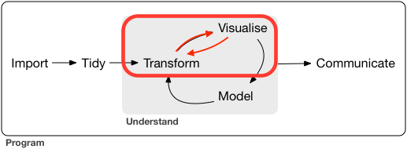

```{r setup, include=FALSE}
knitr::opts_chunk$set(echo = TRUE)
```

## Introduction to Exploratory Data Analysis



## Introduction to Exploratory Data Analysis (cont'd)

Exploratory Data Analysis is an iterative, cyclical process of informally investigating the variables and relationships between them in a dataset.

- Generate questions about your data.

- Search for answers by transforming and visualising your data.

- Use this to refine your questions and/or generate new questions.

Modeling may be a part of this process, but can also be performed later as part of a more formal approach to answer rigorous scientific questions.

## Questions

- What type of variation occurs within my variables?

- What type of covariation occurs between my variables?

## Definitions

- A variable is a quantity, quality, or property that is measured

- A value is the state of a variable when you measure it

- An observation is a set of measurements made under similar condition

## Example dataset: Diamonds

```{r results='hide', message=FALSE, warnings=FALSE}
library(tidyverse)
```

\small
```{r}
diamonds
```
\normalsize

## A note on R functions and code style

Consider the following `ggplot2` code:

```{r eval=FALSE}
ggplot(data=diamonds,
       mapping=aes(x=cut,
                   y=price)) + 
  geom_boxplot()
```

```{r eval=FALSE}
ggplot(diamonds, aes(cut, price)) + geom_boxplot()
```

Both do the same thing.

## R functions and formal arguments

```{}
foo(a = 1, b = 2, c = 3)
```

- All arguments in R functions may be named

- Unnamed arguments will be matched based on their order

- Named arguments may be used in any order

    - Be careful of ordering when mixing named and unnamed arguments!

- You may mix named arguments with unnamed arguments

- Arguments with defaults may be omitted

- Any arguments coming after `...` must be named

## When to name arguments?

This is personal opinion. These are only guidelines!

- The first argument to a function typically need not be named

- Arguments after the first argument should be named

- Arguments that "go together" should both be named or neither should be named

    - E.g. either `aes(x = a, y = b)` or `aes(a, b)`

## Variation

- Variation is the tendency of values of variables to change from measurement to measurement

    - Natural variation
    
    - Measurement error
    
    - Change between subjects
    
    - Change over time
    
- Understand by visualizing the distribution of individual variables

## Visualizing distributions: categorical

```{r fig.height=3, fig.width=4, fig.align='center'}
ggplot(diamonds) + geom_bar(aes(x = cut))
```

## Visualizing distributions: categorical

```{r fig.height=2.5, fig.width=4, fig.align='center'}
diamonds <- mutate(diamonds,
                   color=ordered(color,
                                 levels=rev(levels(color))))
ggplot(diamonds) + geom_bar(aes(x = color))
```

## Visualizing distributions: categorical

```{r fig.height=3, fig.width=4, fig.align='center'}
ggplot(diamonds) + geom_bar(aes(x = clarity))
```

## Visualizing distributions: categorical

Counts can also be calculated manually with `summarise()` or `count()`

```{r eval=FALSE}
diamonds %>% group_by(cut) %>% summarise(n=n())
```

```{r}
diamonds %>% count(cut)
```

## Visualizing distributions: continuous

```{r fig.height=3, fig.width=4, fig.align='center', message=FALSE}
ggplot(diamonds) + geom_histogram(aes(x = depth))
```

## Visualizing distributions: continuous

```{r fig.height=3, fig.width=4, fig.align='center', message=FALSE}
ggplot(diamonds) + geom_histogram(aes(x = table))
```

## Visualizing distributions: continuous

```{r fig.height=3, fig.width=4, fig.align='center', message=FALSE}
ggplot(diamonds) + geom_histogram(aes(x = price))
```

## Visualizing distributions: continuous

```{r fig.height=3, fig.width=4, fig.align='center', message=FALSE}
ggplot(diamonds) + geom_histogram(aes(x = carat))
```

## Visualizing distributions: continuous

Use different bin widths to investigate further.

```{r fig.height=2.5, fig.width=4, fig.align='center', message=FALSE}
ggplot(diamonds) + geom_histogram(aes(x = carat),
                                  binwidth = 0.01)
```

## Visualizing distributions: continuous

Alternatively, set the number of bins.

```{r fig.height=2.5, fig.width=4, fig.align='center', message=FALSE}
ggplot(diamonds) + geom_histogram(aes(x = carat),
                                  bins = 400)
```

## Visualizing distributions: continuous

Bins can also be calculated manually with `cut_interval()` or `cut_width()`

```{r fig.height=3, fig.width=4, fig.align='center'}
diamonds %>% count(cut_interval(carat, n=10))
```

## Outliers

```{r fig.height=3, fig.width=4, fig.align='center', message=FALSE}
ggplot(diamonds) + geom_histogram(aes(x = z))
```

## Outliers

Zoom in on y-axis to see the outliers (x = 0 and x > 30).

```{r fig.height=2.5, fig.width=4, fig.align='center', message=FALSE}
ggplot(diamonds) + geom_histogram(aes(x = z)) +
  coord_cartesian(ylim=c(0, 100))
```

## Outliers

```{r}
diamonds %>% 
  select(carat:price, z) %>% 
  arrange(desc(z))
```

## Remove outliers?

```{r}
filter(diamonds, z > 0, z < 30)
```

## Missing values?

```{r}
mutate(diamonds, z=ifelse(z > 0 & z < 30, z, NA))
```

## Covariation

- Covariation is the tendency of values of two or more variables to vary together in a related way

    - Dependency
    
    - Confounding
    
- Understand by visualizing the relationship between two or more variables

## Between a categorical and a continuous variable

```{r fig.height=2.5, fig.width=4, fig.align='center', message=FALSE}
ggplot(diamonds) + geom_freqpoly(aes(x=price, color=cut))
```

## Between a categorical and a continuous variable

```{r fig.height=2.5, fig.width=4, fig.align='center', message=FALSE}
ggplot(diamonds) + geom_freqpoly(aes(x=price,
                                     y=..density..,
                                     color=cut))
```

## Between a categorical and a continuous variable

```{r fig.height=2.5, fig.width=4, fig.align='center', message=FALSE}
ggplot(diamonds) + geom_histogram(aes(x=price)) +
  facet_wrap(~ cut)
```

## Between a categorical and a continuous variable

```{r fig.height=2.5, fig.width=4, fig.align='center', message=FALSE}
ggplot(diamonds) + geom_histogram(aes(x=price,
                                      y=..density..)) +
  facet_wrap(~ cut)
```

## Between a categorical and a continuous variable

```{r fig.height=2.5, fig.width=4, fig.align='center'}
ggplot(diamonds) + geom_bar(aes(x=cut)) +
  facet_wrap(~ cut_number(price, n=4))
```

## Between a categorical and a continuous variable

```{r fig.height=2.5, fig.width=4, fig.align='center'}
ggplot(diamonds) + geom_boxplot(aes(x=cut,
                                    y=price)) + 
  coord_flip()
```

## Between two continuous variables

```{r fig.height=3, fig.width=4, fig.align='center'}
ggplot(diamonds) + geom_point(aes(x=carat, y=price))
```

## Between two continuous variables

Use transparency to fix overplotting.

```{r fig.height=2.5, fig.width=4, fig.align='center'}
ggplot(diamonds) + geom_point(aes(x=carat, y=price), alpha=1/100)
```

## Between two continuous variables

Use 2D binning to fix overplotting.

```{r fig.height=2.5, fig.width=4, fig.align='center'}
ggplot(diamonds) + geom_bin2d(aes(x=carat, y=price))
```

## Between two continuous variables

Use fixed-width binned boxplots to fix overplotting.

```{r fig.height=2.5, fig.width=4, fig.align='center'}
ggplot(diamonds, aes(x=carat, y=price)) + 
  geom_boxplot(aes(group=cut_width(carat, 0.2)))
```

## Between two continuous variables

Use variable-width binned boxplots to fix overplotting.

```{r fig.height=2.5, fig.width=4, fig.align='center'}
ggplot(diamonds, aes(x=carat, y=price)) + 
  geom_boxplot(aes(group=cut_number(carat, 10)))
```

## Between two categorical variables

```{r fig.height=3, fig.width=4, fig.align='center'}
ggplot(diamonds) + geom_count(aes(x=cut, y=color))
```

## Between two categorical variables

```{r fig.height=2.5, fig.width=4, fig.align='center'}
diamonds %>% count(color, cut) %>%
  ggplot(aes(x=cut, y=color)) + geom_tile(aes(fill=n))
```

## Between two categorical variables

```{r fig.height=3, fig.width=4, fig.align='center'}
ggplot(diamonds) + geom_bar(aes(x=cut, fill=color))
```

## Between two categorical variables

```{r fig.height=2.5, fig.width=4, fig.align='center'}
ggplot(diamonds) + geom_bar(aes(x=cut, fill=color),
                            position="dodge")
```

## Between two categorical variables

```{r fig.height=2.5, fig.width=4, fig.align='center'}
ggplot(diamonds) + geom_bar(aes(x=cut, y=..prop..,
                                fill=color, group=color),
                            position="dodge")
```

## Between two categorical variables

```{r fig.height=3, fig.width=4, fig.align='center'}
ggplot(diamonds) + geom_bar(aes(x=color)) +
  facet_wrap(~ cut)
```

## Between two categorical variables

```{r fig.height=3, fig.width=4, fig.align='center'}
ggplot(diamonds) + geom_bar(aes(x=color, y=..prop..,
                                group=cut)) +
  facet_wrap(~ cut)
```

## Between two categorical variables

```{r fig.height=3, fig.width=4, fig.align='center'}
ggplot(diamonds) + geom_bar(aes(x=cut)) +
  facet_wrap(~ color)
```

## Between two categorical variables

```{r fig.height=3, fig.width=4, fig.align='center'}
ggplot(diamonds) + geom_bar(aes(x=cut, y=..prop..,
                                group=color)) +
  facet_wrap(~ color)
```

## Between three or more variables

```{r fig.height=2.5, fig.width=4, fig.align='center'}
ggplot(diamonds, aes(x=carat, y=price, color=clarity)) + 
  geom_point()
```

## Between three or more variables

```{r fig.height=2.5, fig.width=4, fig.align='center'}
ggplot(diamonds, aes(x=carat, y=price, color=clarity)) + 
  geom_point(alpha=1/100) + 
  geom_smooth()
```

## Between three or more variables

```{r fig.height=2.5, fig.width=4, fig.align='center'}
ggplot(diamonds, aes(x=carat, y=price, color=cut)) + 
  geom_point(alpha=1/100) + 
  geom_smooth()
```

## More "Fair" cut diamonds are larger

```{r fig.height=2.5, fig.width=4, fig.align='center'}
ggplot(diamonds) +
  geom_boxplot(aes(x=cut, y=carat)) +
  coord_flip()
```


