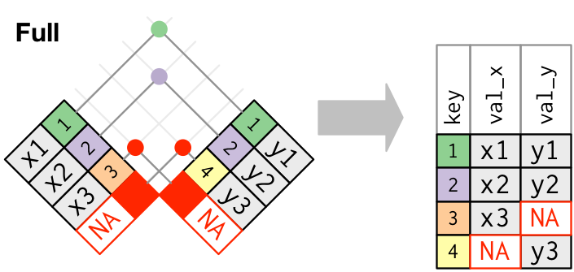
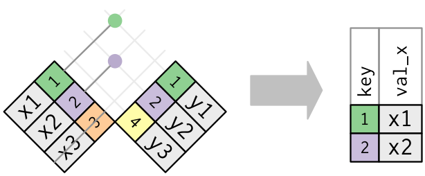

```{r setup, include=FALSE}
knitr::opts_chunk$set(echo = TRUE)
library(tidyverse)
```

## Introduction to Relational Data

What is **relational data**?

Often data analysis involve multiple tables of related data.

The data analysis steps we need to do typically depend on the *relationships* between the different tables of data.

Each relationship is defined on a *pair* of tables.

We need data manipulation verbs that work on pairs of tables.

## Introduction to Relational Data

`dplyr` provides three families of verbs for working with relational data:

- **Mutating joins** add new variables from one data frame to matching observations in another

- **Filtering joins** filter observations from one data frame based on matching observations in another

- **Set operations** treat observations (rows) as elements of a set

Most relational data live in *relational database management systems* (RDBMS) such as MySQL, SQLite, PostgreSQL, etc. and are accessed via Structured Query Language (SQL).

We will see that the names of `dplyr` verbs for relational data are heavily influenced by their SQL equivalents.

## Relational Data in R

```{r}
library(nycflights13)
```

The `nycflights13` package we have been using for examples and homework actually includes five related tables:

- `airlines` gives airline names based on their abbreviated code

- `airports` gives information about airports, identified by `faa` code

- `flights` gives the data on individual flights out of NYC airports

- `planes` gives information about each plane, identified by `tailnum`

- `weather` gives weather information for each NYC airport by hour

## `nycflights13` - `airlines`

\small
```{r}
airlines
```
\normalsize

## `nycflights13` - `airports`

```{r}
airports
```

## `nycflights13` - `flights`

```{r}
flights
```

## `nycflights13` - `planes`

```{r}
planes
```

## `nycflights13` - `weather`

```{r}
weather
```

## Relations in `nycflights13`


## Keys

Variables used to connect tables are called **keys**.

A key may be a single variable, or multiple variables.

- A **primary key** uniquely identifies an observation in its own table

    - `planes` has a primary key of `tailnum`
    
    - `airports` has a primary key of `faa`
    
    - `weather` has a primary key of `(year, month, day, hour, origin)`
    
- A **foreign key** uniquely identifies an observation in another table

    - `flights` has a foreign key of `tailnum` for `planes`
    
    - `flights` has a foreign key of `carrier` for `airlines`
    
    - `flights` has a foreign key of `(year, month, day, hour, origin)` for `weather`
    
## Checking primary keys

```{r}
planes %>% 
  count(tailnum) %>% 
  filter(n > 1)
```

## Checking primary keys

```{r}
weather %>% 
  count(year, month, day, hour, origin) %>% 
  filter(n > 1)
```

## What is the primary key of `flights`?

```{r}
flights %>% 
  count(year, month, day, flight) %>% 
  filter(n > 1)
```

## Add a primary key to `flights`

Called a **surrogate key**.

\small
```{r}
flights %>% 
  mutate(row_id=row_number()) %>%
  select(row_id, year:dep_delay)
```
\normalsize

## Why are keys important?

- A primary key and a foreign key in another table form a **relation**

- These relations are typically "one-to-many"
    
    - `tailnum` in `planes` connecting to many flights in `flights`
    
    - `carrier` in `airlines` connecting to many flights in `flights`
    
- We typically use these relations to describe how we **join** tables

- But as we will see soon, we can explicitly specify which variables are used to join tables, so why else might keys be important?

## How is relational data stored?

- Why don't we always keep all tables in memory like `nycflights13`?

- How do RDBMS's store the data in their tables?

- Are RDBMS's only good for accessing large data on disk?

- Why does data in a RDBMS sometimes occupy more storage space than the actual data?

- Why (as seen in the homework) are keys explicitly specified when creating tables in SQL?

## How does a RDBMS actually manage relational data?

- RBDMS's use **indexing** to look up data faster

- Indexes store where (in storage) to find particular rows in a table

- Indexes require additional storage space but allow faster queries

- Indexes are often a different type of data structure

    - B-trees (sorted data)
    
    - Hash tables (unsorted data)

- Primary and foreign keys are often indexed

- When working with data in memory, this often isn't important, but indexing can be very important when accessing data stored on disk

## Visualizing joins


## Visualizing joins

```{r}
x <- tribble(
  ~key, ~val_x,
     1, "x1",
     2, "x2",
     3, "x3"
)
y <- tribble(
  ~key, ~val_y,
     1, "y1",
     2, "y2",
     4, "y3"
)
```

## Mutating joins

Similar to `mutate()`, **mutating joins** _add new variables_ from one table (`x`) to matching observations in another (`y`)

- **Inner joins** keep only observations the appear in both `x` and `y`

- **Outer joins** keep observations that appear in at least one of `x` or `y`

    - A **left join** keeps all observations in `x`
    
    - A **right join** keeps all observations in `y`
    
    - A **full join** keeps all observations from both `x` and `y`
    
## Mutating joins


## Visualizing joins


## Inner joins


## Inner joins

```{r}
inner_join(x, y)
```

## Inner joins

We can specify the variables used to join `x` and `y` explicitly.

```{r}
inner_join(x, y, by = "key")
```

Joining by all variables that appear in both (default) is a **natural join**.

## Inner joins

`dplyr`:

```{r eval=FALSE}
inner_join(x, y, by = "z")
```

`base` R:

```{r eval=FALSE}
merge(x, y, by = "z")
```

SQL:

```{}
SELECT * FROM x INNER JOIN y USING (z)
```

Inner joins can silently drop observations, so are rarely used for data analysis.

## Outer joins


## Left join


## Left join

```{r}
left_join(x, y)
```

## Left join

`dplyr`:

```{r eval=FALSE}
left_join(x, y, by = "z")
```

`base` R:

```{r eval=FALSE}
merge(x, y, all.x = TRUE, by = "z")
```

SQL:

```{}
SELECT * FROM x LEFT OUTER JOIN y USING (z)
```

Left joins are the most common type of join.

## Right join


## Right join

```{r}
right_join(x, y)
```

## Right join

`dplyr`:

```{r eval=FALSE}
right_join(x, y, by = "z")
```

`base` R:

```{r eval=FALSE}
merge(x, y, all.y = TRUE, by = "z")
```

SQL:

```{}
SELECT * FROM x RIGHT OUTER JOIN y USING (z)
```

## Left versus right joins

What is the difference between the following calls?

```{r, eval=FALSE}
left_join(x, y)
```

```{r, eval=FALSE}
right_join(y, x)
```

---

```{r}
left_join(x, y)
right_join(y, x)
```

## `left_join(x, y)` vs `right_join(y, x)`

- The only difference is the order of the returned columns

- Explicit right joins exist primarily for expressiveness

- Some RDBMS's do not even implement right joins (e.g., SQLite)

## Full join



## Full join

```{r}
full_join(x, y)
```

## Full join

`dplyr`:

```{r eval=FALSE}
full_join(x, y, by = "z")
```

`base` R:

```{r eval=FALSE}
merge(x, y, all.x = TRUE, all.y = TRUE, by = "z")
```

SQL:

```{}
SELECT * FROM x FULL OUTER JOIN y USING (z)
```

## Duplicate keys


## Duplicate keys


## Differently-named keys

```{r}
x2 <- x %>% rename(a = key)
y2 <- y %>% rename(b = key)
left_join(x2, y2, by = c("a" = "b"))
```

## Plot most popular flight destinations

```{r pop-dest, eval=FALSE}
flights %>%
  filter(dest != "HNL", dest != "ANC") %>%
  count(dest) %>%
  left_join(airports, by = c("dest" = "faa")) %>%
  ggplot(aes(lon, lat, size=n, color=n)) +
  borders("state") +
  geom_point() +
  coord_quickmap()
```

---

```{r pop-dest, echo=FALSE, message=FALSE, fig.align='center'}
```

## Get total number of flights flown by each type of plane

```{r}
flights %>%
  left_join(planes, by = "tailnum") %>%
  count(type)
```

## Filtering joins

Similar to `filter()`, **filtering joins** do not add new variables, but instead _subset the observations_ from one table (`x`) based on observations in another (`y`)

- **Semi joins** *keep* all observations in `x` that have a match in `y`

- **Anti joins** *drop* all observations in `x` that have a match in `y`

## Semi joins



## Semi joins

```{r}
semi_join(x, y)
```

## Semi joins with duplicate keys


Semi joins never duplicate rows (unlike mutating joins).

## Keep only flights from most popular destinations

\small
```{r}
top_dest <- flights %>%
  count(dest) %>%
  filter(n > 10000)

semi_join(flights, top_dest)
```
\normalsize

## Anti joins


## Anti joins

```{r}
anti_join(x, y)
```

## Why did we have missing values when plotting destination airports?

```{r}
flights %>%
  anti_join(airports, by = c("dest" = "faa")) %>%
  count(dest)
```

## Set operations

Set operations take two tables with the same variables and compare whole rows (i.e., every variable in each row), to treat observations like members of sets.

- `intersect(x, y)` returns observations in both `x` and `y`

- `union(x, y)` returns all unique observations in `x` and `y`

- `setdiff(x, y)` returns the observations in `x` that aren't in `y`

These are less commonly used for data analysis than the joins.

## Set operations

```{r}
df1 <- tribble(
  ~x, ~y,
   1,  1,
   2,  1
)
df2 <- tribble(
  ~x, ~y,
   1,  1,
   1,  2
)
```

## Intersection

```{r}
intersect(df1, df2)
```

## Union

```{r}
union(df1, df2)
```

## Difference

```{r}
setdiff(df1, df2)
```

## R and databases

Often, relational data is stored in a database managed by an RDBMS, so we need to know how to work with data in a database.

A database can also be a good solution for data which you do not want to load all into memory at once.

R and `dplyr` can interface with databases through the `DBI` package and a suitable backend:

- `RSQLite` works with SQLite databases

- `RMySQL` works with MySQL databases

- `RPostgreSQL` works with PostgreSQL databases

etc.

We can work with these with `dplyr` using the `dbplyr` package.

## R and databases with `dbplyr`

Suppose we wish to work with an SQLite database.

First we need to install the necessary packages.

```{r eval=FALSE}
install.packages(c("DBI", "RSQLite", "dbplyr"))
```

```{r}
library(dbplyr)
library(RSQLite)
```

## Connecting to a database in R

The DBLP is a database containing bibliographic data on major computer science journals and proceedings. A subset of it has been loaded into the SQLite database file "dblp.db".

First, we need to open a *connection* to the database using `dbConnect()`.

The first argument of `dbConnect()` is the backend to use (provided by the `RSQLite` package in this case), and the second is the filepath to the database.

```{r}
dbpath <- paste0("~/Documents/Northeastern/",
                 "Courses/DS5110-Spring2018/data/",
                 "DBLP-CSR-sqlite/dblp.db")
con <- dbConnect(SQLite(), dbname=dbpath)
```

## Creating a `tbl` of the connected database

A `tbl` is the tidyverse's generalized notion of tabular data.

A tibble is a type of `tbl`. We can also create a `tbl` from a database.

```{r}
dblp <- tbl(con, "general")
```

The first argument is the data source (our database connection).

The second argument is the name of the table within the database.

Our SQLite database contains the table "general", which has information about papers published in computer science journals and proceedings.

---

```{r}
dblp
```

---

We can perform `dplyr` operations on the database using `dplyr` verbs.

```{r}
dblp %>% summarise(cs_papers=sum(cs))
```

---

```{r}
dblp %>%
  filter(year > 2010) %>%
  group_by(year) %>%
  summarise(cs_papers=sum(cs))
```

---

Note that the result isn't actually pulled into memory automatically.

```{r error=TRUE}
dblp %>%
  filter(year > 2010) %>%
  group_by(year) %>%
  summarise(cs_papers=sum(cs)) %>%
  ggplot() +
  geom_col(aes(x=year, y=cs_papers))
```

---

To force `dplyr` to execute the operations and pull the result into memory, we need to use `collect()`. 

```{r fig1, error=TRUE, eval=FALSE}
dblp %>%
  filter(year > 2010) %>%
  group_by(year) %>%
  summarise(cs_papers=sum(cs)) %>%
  collect() %>%
  ggplot() +
  geom_col(aes(x=year, y=cs_papers))
```

---

```{r fig1, echo=FALSE}
```

---

When working with databases, `dbplyr` tries to offload as much work as possible to the database itself, and delay execution until we need the result.

We can see the actual SQL commands generated using `show_query()`

```{r}
query <- dblp %>%
  filter(year > 2010) %>%
  group_by(year) %>%
  summarise(cs_papers=sum(cs))
show_query(query)
```

## Pulling database data into R

Not all databases support all `dplyr` data manipulation verbs, so if necessary (and the data is small enough), we can always pull the data into R as a tibble and work that way.

```{r}
dblp %>% collect()
```


